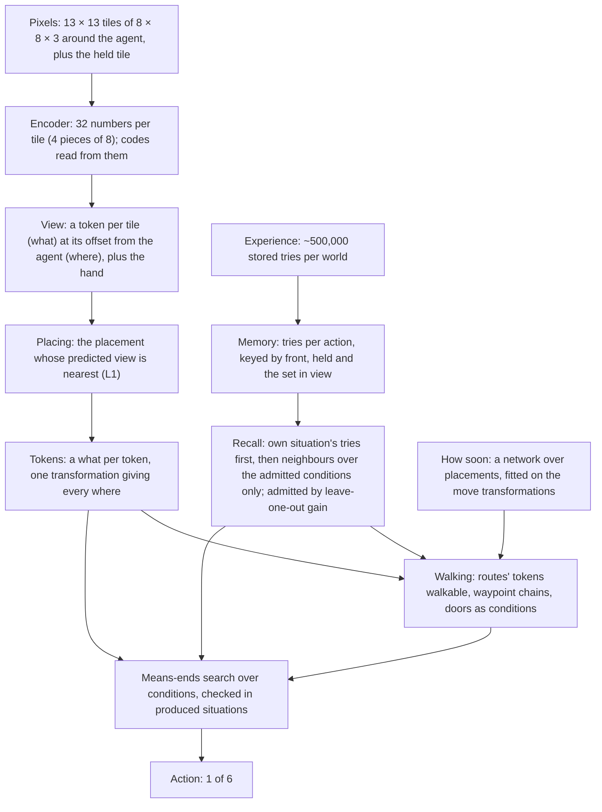

# Architecture

Version 9 is version 8 with a new recall: an action's outcome is
predicted only from the conditions that changed outcomes in memory, and
a situation's own tries come before its neighbours
([card 049](experiments/049-recall-through-conditions/card.md) and
[card 050](experiments/050-own-tries-first/card.md), kept on
2026-10-04). Version 8 plans on the encoder's vectors, with the state
held as tokens and walking as a learned approach plus its conditions. It
was built up in cards 038–047:
- version 6 was kept with
  [card 043](experiments/043-consistent-hypotheticals/card.md);
- [card 044](experiments/044-state-as-tokens/card.md) made the state a
  set of tokens, each a what and a where;
- [card 045](experiments/045-movement-through-conditions/card.md) made
  walking a learned approach plus its conditions;
- [card 047](experiments/047-situations-from-both-levels/card.md) takes
  the situations for an action on a thing from both of recall's levels.

It follows
the direction signed off in
[card 022](experiments/022-effects-post-mortem/card.md): the primitive is
the effect of an action, learned from the agent's own outcomes, and moves
are actions like any other. It also follows CHARTER.md's "Current
direction": one latent space, codes as names, recall instead of counting.

Given only "reach the goal square", it works backward through what recall
predicts at every step. In four logic-door worlds (the door opens with
the key, the switch, either, or both) it reaches the goal in 100% of 500
new layouts in 5 of 5 encoder seeds. It takes the same steps as version 5
(card 029) to within 0.8%. In unseen rooms (6 × 6, 7 × 7 and mirrored
8 × 8) it reaches the goal in 100%, at 1.01–1.11 times the shortest
route. Version 9 keeps these results (card 050: familiar worlds 100%,
steps 0.93–0.97 times card 029's) and adds robustness to tokens that do
not matter: card 048's chained rooms with one door 98% in every seed
(version 8: 46% in seed 401), and a key world cluttered with extra keys,
switches and vases 98–100% (version 8: 92–100%). It is not a passed
rung: the world is fully visible, repeats pixels exactly, and every
familiar appearance has been seen.

The code is `tools/card050/own.py` (own tries first), on
`tools/card049/conditions.py` (recall through admitted conditions;
`worlds.py` holds card 048's chained rooms and the cluttered key world),
on `tools/card047/situations.py`, which builds on:
- `tools/card045/movement.py`: walking through conditions;
- `tools/card044/tokens.py`: the state as tokens;
- `tools/card043/consistent.py`: conditions checked in produced situations;
- `tools/card042/code_recall.py`: recall in two levels;
- `tools/card039/slot_planner.py`: the view as a set;
- `tools/card038/vector_planner.py`: the planner on vectors;
- `tools/card028/effects.py`: the counted move correspondences the
  transformations are fitted to, through card 037's chain.

Version 5, the counted model over exact tile IDs, is in git (commit
`33f9949`).

## In brief

- **Encoder.** A small convolutional network maps each 8 × 8 × 3 tile to
  32 numbers, in 4 pieces of 8. Each piece has a codebook of 8 learned
  codes. A code is a region of its piece's space (the cells around one
  entry), so codes and vectors are one latent space read at two
  resolutions. It is trained once, offline, and fixed while acting.
- **Memory** keeps every stored try per action, keyed by the vectors of
  the thing in front, the held thing and the set of things in view, with
  its outcomes.
- **Recall** (version 9) predicts a pick up, toggle or drop from the
  **conditions admitted** for that action, and nothing else in view:
  - candidates are the front and held tiles' four parts, a front–held
    relation per part (a distance), and "a token with this code tuple is
    in view";
  - a candidate is admitted while it raises the leave-one-out likelihood
    of the stored outcomes by more than log(number of candidates), so a
    token present in every try (a key always on the floor) never enters;
  - **own tries first:** the tries in the query's own situation (the
    same front and held code tuples, the same admitted view values) are
    the evidence, and the condition-weighted neighbours only their prior
    (α fitted, 0.00012): one failed try overrules the neighbours there.
  Moves, draw and undraw keep version 8's recall.
- **Acting** is card 029's means-ends search, recomputed at every step. A
  condition is checked only in situations that recall's predicted effects
  produce from the present. The situations in which an action could work
  on a thing come from tries on the same thing and on similar things, and
  recall judges each (card 047): a failed try rules out its own
  situation, not the thing.
- **Walking** (card 045): a small network predicts how soon the agent can
  stand at a placement (System 1); the approach works when the tokens on
  its route are walkable, and chains of approaches through waypoints, or
  a door as a condition, cover the rest (System 2). No step is imagined
  while walking.
- About 0.42–0.72 seconds per layout in the familiar worlds in version 8
  (version 5: 0.015–0.024); version 9 was timed only with many runs
  sharing the machine (2–17 s), and its cost per query grows with memory
  (Known limits).

## How the state is represented

Since card 044 the state is a set of tokens:
- **A token** is a what (a tile's vector; its codes are read from it) and a
  where: its offset from the agent (x to the right, y ahead; the place
  ahead is (0, 1)), or the hand. Every tile seen is a token, floor and
  walls included, and so is the held thing. A token exists once seen; a
  where no token holds shows the learned appearance of places entering the
  view (wall here).
- **A move** sends every where but the hand's to M_m where + b_m, fitted
  by least squares to the counted move correspondences (exact: quarter
  turns and a one-tile shift). Since a move moves every token alike, a
  situation stores the whats by token id and one transformation; a
  token's where is that transformation applied to its where at first
  sight. There is no pose table.
- **Readers address tokens by where:** ahead is the token at (0, 1), held
  is the hand's, in view are the tokens within 6 tiles.
- **Recall reads three roles** (declared exception, card 044): the
  token ahead, the hand's, and what is in view, positions dropped. Since
  card 049 the view enters only through admitted conditions, each "a
  token with this code tuple is in view", so tokens no condition reads
  cost nothing.
- **Codes** are discrete per tile (4 codebook indices, as in a VQ-VAE).
  Recall uses them for "the same thing". They name appearances, not
  things.

Card 040's tokens (each thing its vector plus its role, with attention
over pairs) were stopped and are not used.

## Data structures

| Name | Type and size | What it holds | How it is obtained |
|---|---|---|---|
| Tile vector | float[32], 4 pieces of 8 | One tile's appearance; each distinct vector is stored once (a handle) | The encoder (card 037's recipe) |
| Code tuple | 4 ints, or "new" per piece | Which codebook region each piece falls in | Nearest used code within 6 × its radius, else "new" (card 035), with fresh codes for new pieces (card 036) |
| View | 182 handles: 169 wheres within 6 tiles, plus the held row | What the agent sees now | Encoder on the renderer's tiles |
| Key of a try | (front handle, held handle, view set) | Pick up, toggle, drop. Moves, draw and undraw are keyed by one handle | From the stored views |
| Outcome class | (which places changed, the codes they became) | What a try did | From the try's next view |
| Memory | Per action: keys with outcome counts and result vectors | Every stored try, never merged | 5,000 random episodes per world; real tries are added while acting |
| Admitted conditions | Per pick up, toggle and drop: the front tile's 4 parts plus up to about 4 more (held part, front–held relation per part, a code tuple in view), each with a weight λ | What recall reads | Greedy admission by leave-one-key-out likelihood, cost log(candidates) per condition; λ refitted jointly (card 049) |
| Own-situation prior | α per action | How much the neighbours count against a situation's own tries | Leave-one-try-out likelihood (card 050) |
| Version 8's recall weights | λ1, λ2, β | Still fitted: the planner's situations (card 047) read them | As version 8 (card 042) |
| Move transformation | Per move: M (2 × 2), b (2) | How a move changes every where | Least squares on the counted correspondences of places before and after moves (cards 028, 044) |
| Placement | One transformation, of 676 reachable by composing the moves' | Where every token is relative to the agent | Composed from the move transformations |
| Tokens, situation | A handle per token id (638 ids: the first view's places, the held row, the rest within 12 tiles), "absent" where none seen; (tokens, placement, ended) | Belief, real or imagined | Placed views, written in by where |
| Condition | ("end"), ("walk", j), ("face", a, u, j), ("part", hand or view, a, u, j, c, …) | What must hold for an action to have an effect | Worked out from memory (card 038) |
| How-soon network | 4 inputs (the placement's offset from the agent and its relative heading), 3 outputs (one per move) | Steps until the agent stands at a placement, after each move | Fitted Q-iteration on the move transformations, every place within 6 tiles and heading a target (card 045) |
| Routes | Per pair of the 676 placements: steps V, first move, the tokens stepped onto | The approach between two placements | Worked out once from the network's moves and the transformations |

## Learning

Per world:
1. **Encoder** (once, offline). The objective has:
   - rebuilding the tile's pixels through a decoder;
   - codebook and commitment terms;
   - a pair term, so that an action changing a tile in place changes few
     codebooks;
   - μ = 0.01 times a recall term: the leave-one-out likelihood of stored
     outcomes.

   Nothing names what a code means.
2. **Move transformations**: card 028's counted correspondences, then a
   least-squares fit per move (card 044).
3. **Memory**: the stored tries, grouped by key, with outcome counts.
4. **Recall weights**, fitted by leave-one-key-out likelihood of the
   outcome classes, about 25 seconds per world:
   - pick up, toggle and drop: card 042's two levels (kept for the
     planner's situations), then card 049's admission of conditions
     (1–5 s per action) and card 050's α;
   - moves: card 038's single level on the thing in front.
5. **How-soon network** (card 045): Q(g, m) = 1 + min Q(T_m g, ·), and 0
   at the target, where T_m is move m's transformation; hindsight, so every
   place and heading is a target. It is exact in open space.

## Acting

At every step:
1. **Place the view.** Take the placement whose predicted view is nearest
   the real one (L1 over vectors, the centre aside). The tokens in view
   take the view's whats.
2. **Predict effects by recall.**
   - Where the query's own situation has tries, the category and the
     result are what it did then.
   - Otherwise the neighbours over the admitted conditions predict, and
     the result is imagined by carrying the change over from them (card
     038's ways: keep, copy, shift, set).
3. **Work backward** from "episode ended", as in version 5:
   - the achievers of a condition are the actions whose predicted effect
     makes it true;
   - an achiever's needs are its conditions, then facing its thing;
   - a condition on a pick up, toggle or drop comes from memory: which
     part (the hand, or what is in view) must change. Its candidates are
     the situations of the tries on the same thing and on similar things,
     each judged by recall's prediction (card 047);
   - such a need is met in a situation where the action works with that
     situation's own hand and view. That situation comes from imagining
     an achiever's effect on the present (card 043).
4. **Walk** through conditions (card 045):
   - System 1: the how-soon network gives the steps and first move to any
     placement facing the target, and the route's tokens;
   - System 2: the route works when its tokens are walkable (recall's
     forward kind). Otherwise a chain of clear approaches through up to 6
     waypoints is taken (least total steps);
   - when no chain exists, tokens recall predicts a pick up or toggle can
     make walkable (card 047) are counted walkable; those a least chain
     crosses become conditions ("walk", j), pursued like any other;
   - alternatives (the key or the switch) are chosen by the chains'
     predicted steps.
5. **Revise** as in version 5.

## Present but not used by the agent

- Card 040's relations by attention over things as tokens
  (`tools/card040/`, stopped).
- Version 5's counted tables and rule lists (`tools/card028`, `card029`),
  used for comparison only.

## Components

| Component | What it does | Input → output | Source (see LITERATURE.md) | Borrowed vs changed |
|---|---|---|---|---|
| Encoder and codes | Tiles to vectors and their codebook regions | Pixels → 32 numbers, 4 codes | `1711_00937`, `1803_03382`, cards 031–036 | Pair and recall terms added; "new" by radius; fresh codes |
| Recall | An action's outcome from stored tries | Key → outcome class and result | MacKay and Peto 1995; Nosofsky's GCM; `1604_02354`; Cheng 1997; Griffiths and Tenenbaum 2005; `1110_2211`; cards 042, 049, 050 | Only admitted conditions read (contrast with a cost per condition); own situation first, neighbours as prior |
| Tokens and placements | What the agent has seen and where it is now | View → (tokens, placement) | Card 016; `1905_12006`; transformer patch tokens (Dosovitskiy et al. 2020); `1812_02230`; card 044 | Moves as fitted transformations of where; matching by L1 over vectors |
| Subgoals | Which condition to pursue next, down to an action | Facts, recall → action | `strips`, `cs_9401101`; cards 029, 038, 043 | Conditions from memory, checked in produced situations |
| Walking | Reach a placement facing a target | Tokens, placements, recall → move | `universal-value-function-approximators`, `1707_01495`, `1906_05253`; skill chaining (Konidaris and Barto 2009); card 045 | One how-soon network over the learned move transformations; the route's tokens as its conditions; waypoint chains; doors as conditions |

## Built-in priors and supplied information

- **The observation** is card 016's egocentric view: the whole room
  (radius 6, 8 × 8 rooms), 8-pixel tiles on a grid, the agent at the
  centre facing up, and the held tile in a fixed place. The agent receives
  pixels only.
- **Declared forms:**
  - "in front", "held" and "in view" are where-values recall's key reads
    (the token at (0, 1), the hand's, the tokens within 6 tiles);
  - wheres lie on the view's grid; tokens are kept within 12 tiles of the
    first view's centre;
  - a tile is 4 pieces of 8 numbers, with codebooks of 8;
  - "new" is 6 × a code's radius;
  - recall's candidate conditions: per part of the front and held tiles,
    a front–held distance per part, a code tuple present in view; a
    condition costs log(number of candidates) to admit;
  - an outcome is predicted when its probability is at least one half;
  - a vector-level neighbour counts at k ≥ 0.01.
- **The procedures are designed, not learned:** the order of needs, the
  search depth (6), the route procedure (card 045's declared exception),
  and the order of moves among equals (forward, left, right).
- **Goal and experience.** The episode's end is observed, and reaching the
  goal square is the only goal. Experience is 5,000 random episodes per
  world, stored as in version 5.
- **The evaluator** reads the simulator for checks only.

## Known limits

- **Parts mix kind and colour.** Each action now reads only the parts
  admitted for it, but which parts differs by seed (part 0, 2 or 3, held
  or relation), because the encoder spreads colour and kind over all four.
  In seed 403 this let a never-seen purple key read as fitting the red
  door until one try said otherwise. Card 052 (the staged encoder) is
  meant to give colour a part of its own.
- **New colours.**
  - First-sight effects were right in 2 of 5 seeds.
  - The switch world with a new-colour door: mean 76% with card 049's
    recall (above 90% in 7 of 10 runs; seed 401 14%, mostly random
    steps), against 40% in version 8 (card 047). Not rerun with own
    tries first beyond a 6-layout trial.
  - Low support reads as "fails", not "unknown", so a new door may never
    be tried (card 051, change 7).
  - There are no relations ("this key fits this door"), and colour
    transfer is paused by the user.
- **Chance.** An outcome is acted on only when its probability is at least
  one half, so an action that works some of the time in the same
  situation reads as not working (the user, 2026-10-01: later).
- **Conjunctions.** A success that needs both the hand and the view
  changed is still checked in a spliced situation (card 043's declared
  exception).
- **No commitment between steps.** The chain of conditions is rebuilt
  every step and protects only what is in the current chain, so a later
  need can undo an earlier one: two doors 0 of 150 (key A picked up and
  dropped in turn), and one cluttered layout the same way (card 051).
- **Exact views.** It needs the whole room in view and exact pixel
  repeats. Codes absorb small differences, but this is untested with
  noise, and vectors near a region's edge could flip codes between views.
- **A small fixed world.** Routes are worked out for every pair of the
  676 placements, and tokens live on a fixed grid of 638 places. A larger
  or partly seen world needs routes on demand and a map.
- **Slower than version 5:** 0.42–0.72 s per layout in the familiar
  worlds, against 0.015–0.024; the switch world with a new-colour door
  4–19 s. Card 047's wider situations cost 31–77% over card 046.
- **Cost grows with memory; must be near-linear before BabyAI or
  Crafter** (the user, 2026-10-03). Every recall query compares the
  query with every stored try (about 0.1 ms per thousand tries, card
  049), and memory grows by up to one try per step, so a lifetime of T
  steps costs about T². Card 049's admission of conditions builds an n × n
  matrix per candidate (20 GB per candidate at 50,000 tries). The
  planner re-derives its whole chain of conditions every step. Target:
  per-step cost linear in the tokens and conditions in play, independent
  of memory size (own situations by hash, neighbours by approximate
  nearest-neighbour search, admission on groups of equal codes, the
  chain kept and repaired rather than rebuilt).

## Change log

| arch_version | Date | Card | Change |
|---|---|---|---|
| 1 | 2026-09-27 | 017 | User-authorized shared map and nonspatial context; condition/readiness heads and walking forward path implemented; four structural tests pass, component fitting waits for adequate class coverage |
| 2 | 2026-09-27 | 017 | Replace only readiness's radius-one readout with radius six after exact input collisions; retain the shared map, context, conditions and walking recurrence |
| 3 | 2026-09-28 | 019–020 | Share local spatial feature updates across distance; conditions and readiness use the same processor. Controlled test: both 99.61%; full-tree and learned walking gates remain pending |
| 4 | 2026-09-28 | 022–028 | Direction change signed off with card 022; kept with card 028. Replace the neural spatial learner with counted kinds (027) and a counted model of every action's effects (028); conditions, walking, tree growth and targets computed on it, nothing read from the simulator. 100% in both worlds, the simulator's moves exactly |
| 5 | 2026-09-28 | 029 | Subgoals worked backward through the learned rules (means-ends analysis, recomputed every step) replace the evidence-grown tree and the target rule for acting. 100% in four worlds (key, switch, either, both), 1.03–1.11 times the shortest route, 6–9 conditions per move |
| 6 | 2026-10-01 | 038–043 | Plan on encoder vectors: recall over stored tries replaces the counted tables; the view as a set (039); recall in two levels, equal codes for the same thing and vectors for similar things (042); conditions checked only in situations the learned effects produce (043). Kept by the user with card 043: 100% in all four worlds in 5 of 5 seeds, effects exact, card 029's steps |
| 7 | 2026-10-01 | 044 | The state as tokens: every tile and the held thing a what and a where (offset from the agent, or the hand); moves as least-squares transformations of where, fitted to the counted correspondences (exact); no pose table. Kept by the user with card 044: the same decisions as version 6 in every familiar world, 5 of 5 seeds; 12% slower per layout |
| 8 | 2026-10-01 | 045–047 | Walking through conditions (045): a how-soon network fitted on the move transformations (System 1), the route's tokens walkable as its conditions, waypoint chains and doors as conditions (System 2), no imagined step. Situations for an action on a thing from both of recall's levels, each judged by recall (047, after 046 used the levels as a switch). Kept by the user with card 047: the same results in the familiar worlds, 100% in unseen rooms at 1.01–1.11 times the shortest route; new-colour switch tests 40% (version 7: 31%); 31–77% slower than card 046 |
| 9 | 2026-10-04 | 049–050 | Recall through the conditions that matter: for pick up, toggle and drop, only conditions admitted by their leave-one-out gain (front and held parts, front–held relations, code tuples in view) are compared, so tokens that never changed an outcome cannot veto a memory (049); a query's own situation first, neighbours as its prior, so one failed try corrects recall (050). Kept by the user with card 050: familiar worlds 100% in 5 of 5 seeds, chained rooms with one door 98% (version 8: 46% in seed 401), cluttered key world 98–100%; new-colour switch door 76% with card 049 (version 8: 40%) |
