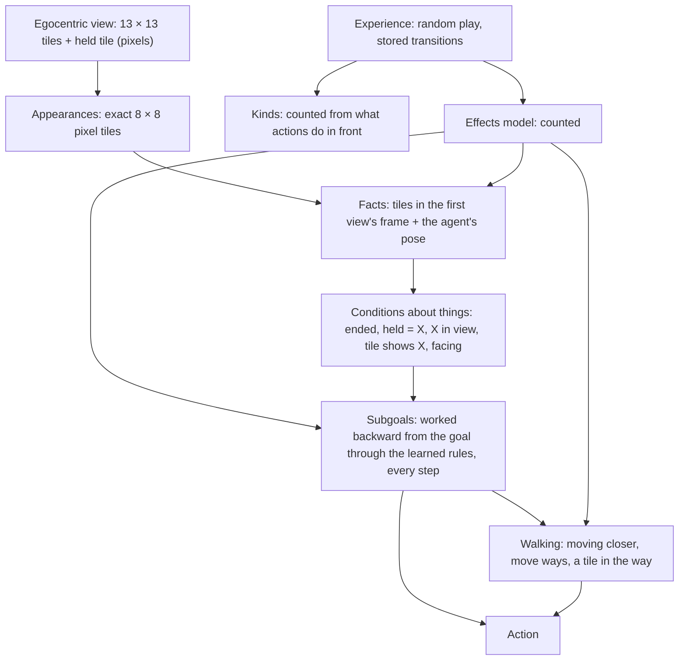

# Architecture

Version 5 is the counted model of
[card 028](experiments/028-learned-effects-model/card.md) with subgoals
worked out from it, kept with
[card 029](experiments/029-subgoals-from-the-model/card.md). It follows
the direction signed off with the user in
[card 022](experiments/022-effects-post-mortem/card.md): the primitive is
the effect of an action, learned from the agent's own outcomes, and moves
are actions like any other. Everything the agent thinks with is learned by
counting from its own egocentric views; nothing it thinks with reads the
simulator. Given only "reach the goal square", it works backward through
its learned rules at every step. In four logic-door worlds (the door opens
with the key, the switch, either, or both) it reaches the goal in 100% of
500 new layouts, at 1.03–1.11 times the shortest route's steps. It is not
a passed rung: the world is fully visible, repeats pixels exactly, and
every appearance has been seen. Version 3, the neural spatial learner of cards 017–021
(`src/worldmodel/spatial_state.py`), failed its full-tree gate (card 021)
and is historical; its description is in git (commit `dab1240`).

The code is `tools/card029/subgoals.py` (subgoals and acting) on
`tools/card028/effects.py` (the model, facts, poses, walking). Card 026's
tree and card 027's target rule remain in that code for comparison; acting
no longer uses them.

## Overview

## The learned parts

1. **Appearances** (card 027). Each tile of the view is an exact pixel
   tile; the held tile shows what the agent carries (an empty hand looks
   like floor).
2. **Kinds** (card 027). Appearances in front are grouped by counting what
   each action did to them (bisimulation refinement with
   Dirichlet-multinomial evidence). This gives the 8 expected kinds in both
   worlds, without labels. A network trained on the counted kinds exists
   for recognising new appearances (the transfer card); it is not needed
   when every appearance has been seen.
3. **Effects** (card 028), all counts:
   - Moves: one fixed map per move (for each place after, the place before
     that predicts it and how), the tiles entering at the edge, and
     whether the move changes the view, by the appearance in front
     (changed, unchanged, episode ended).
   - Pick up, drop, toggle: the places that change (in front and held), and
     the change per appearance in front (and held, for drop).
   - Rules, where one key has several outcomes: card 010's evidence finder
     over "held = X" and "X in view". Found: a closed door opens when
     "held = key of its colour" (key world) or "switch on in view" (switch
     world); a key is picked up when "held = floor".
4. **Facts and poses** (card 028). The agent keeps the tiles in the frame
   of its first view of the episode, with its own tile undrawn. Its poses
   are all combinations of the learned moves (484). Each new view is placed
   by matching it against the view predicted from every pose.
5. **Conditions** (card 029): facts about the agent's facts. The episode
   has ended; the hand shows X; X is in view; tile i shows X; facing one
   of the tiles T, standing on a free tile.
6. **Subgoals** (card 029): means-ends analysis through the learned rules,
   recomputed from the top at every step. Each learned outcome is read as
   an action with needs and results: toggle a closed red door needs
   "held = key red" (its rule's atoms) and facing the door, and makes the
   tile an open red door. A condition's achievers are the actions whose
   result makes it true. Their needs are checked in order (what the outcome
   is keyed on, the rule's atoms, facing last), and the first unmet one
   becomes the subgoal, down to depth 6. Among achievers: the fewest unmet
   needs, then the nearest walking target. An action is refused when, in
   the head, it undoes a condition met higher in the chain or leaves a
   facing higher in the chain unreachable; an (action, tile, pose) is
   marked failed when acting there does not give the predicted result.
7. **Walking** (cards 024, 026, 029). Facing is reached by moving closer
   (card 024's step measure in the frame's grid: tiles away, then turns),
   then move ways computed in the head (poses from which one or two moves
   let moving closer succeed). Last comes a tile in the way: a tile that
   some action makes passable, whose change lets the walk succeed, becomes
   a subgoal ("tile j shows an open door").

## Components

| Component | What it does | Input → output | Source (see LITERATURE.md) | Borrowed vs changed |
|---|---|---|---|---|
| Kinds | Groups appearances by what actions do to them | Front appearances, outcomes → kind per appearance | `equivalence-notions-and-model-minimization-in-markov-decisio`, `1412_2309` | Bisimulation over appearances in front, scored by evidence; classes from experiments as Chalupka's first step |
| Effects | What each action does to the facts | Facts, action → next facts | `1110_2211`, `an-object-oriented-representation-for-efficient-reinforcemen` | Rules over appearances counted from pixels, not supplied objects; move maps counted, not declared |
| Rules | When an effect happens | Atoms "held = X", "X in view" → rate | `1511_01644` (card 010) | Reused unchanged, positive atoms, storage weights |
| Facts and poses | Where the agent is in what it has seen | View → (facts, pose) | Card 016; `1905_12006` | Poses from composing learned moves; placing by matching |
| Subgoals | Which condition to pursue next, down to an action | Facts, learned outcomes and rules → action | `strips`, `cs_9401101`; card 029 | Operators counted from pixels, not written by hand; re-evaluated from the top every step; card 027's revision rules generalised |
| Walking | Reach a pose facing a target | Facts, poses, learned moves → move | Cards 024, 026 | Moving closer, then move ways computed in the head; a tile in the way becomes a subgoal |

## Built-in priors and supplied information

- The observation is card 016's egocentric view: the whole room (radius 6,
  8 × 8 rooms), 8-pixel tiles on a grid, the agent at the centre facing
  up, a held tile in a fixed place. The renderer uses the simulator's pose
  to produce it; the agent receives pixels only.
- Appearances are exact pixel tiles: identity by exact repeat, no noise.
  "In front" and "held" are fixed places; a thing looks the same wherever
  it is (card 027).
- Declared forms: a move leaves the view as it was or sends every tile to
  one fixed place; a pose is where the agent stands and which way it
  faces; outcomes are keyed by the appearance in front (and held, for
  drop); an outcome is reachable when its rate is at least one half; an
  unseen appearance is blocked and unchanged by every action.
- The procedures are designed, not learned: the evidence tests, the
  kinds of condition, the order of needs, choosing the nearest target
  among alternatives, depth 6, move ways two moves deep, moving closer by
  the step measure.
- The episode's end is observed, and reaching the goal square is the only
  goal. Experience is 5,000 episodes of random play per world: every
  change stored, other steps one in eight (weighted), 300 full sequences.
- The evaluator reads the simulator for the checks only: facts against the
  simulator's contents, and learned conditions against exact ones.

## Training signals

None by gradient. Every learned part is counts over the stored experience,
with Bayesian evidence deciding groupings and rules. The model is learned
in about a second per world; acting needs 6–9 conditions per move and
0.015–0.024 seconds per layout. No tree is grown.

## Known limits

- Knows nothing about appearances it has not seen: from 500 episodes, an
  unseen "agent on an open green door" made that door a wall, and
  agreement with exact conditions fell to 68% for one node (card 028).
- Rules are per appearance ("held = key red" for the red door), not
  relations ("held key's colour = door's colour"); they will not carry to
  new colours.
- Needs the whole room in view and exact pixel repeats; no memory, no
  partial views, no noise.
- Walking in the head chains steps one by one (card 022's open point for
  P21), and gets stuck on long detours: a tile in the way counts only if
  walking then succeeds, so the door is not found as the obstacle when the
  way to it is a detour (2 layouts of 2,000, card 029).
- The choice between alternatives (the key or the switch) is a declared
  rule, the nearest target, not learned from the agent's own costs.

## Change log

| arch_version | Date | Card | Change |
|---|---|---|---|
| 1 | 2026-09-27 | 017 | User-authorized shared map and nonspatial context; condition/readiness heads and walking forward path implemented; four structural tests pass, component fitting waits for adequate class coverage |
| 2 | 2026-09-27 | 017 | Replace only readiness's radius-one readout with radius six after exact input collisions; retain the shared map, context, conditions and walking recurrence |
| 3 | 2026-09-28 | 019–020 | Share local spatial feature updates across distance; conditions and readiness use the same processor. Controlled test: both 99.61%; full-tree and learned walking gates remain pending |
| 4 | 2026-09-28 | 022–028 | Direction change signed off with card 022; kept with card 028. Replace the neural spatial learner with counted kinds (027) and a counted model of every action's effects (028); conditions, walking, tree growth and targets computed on it, nothing read from the simulator. 100% in both worlds, the simulator's moves exactly |
| 5 | 2026-09-28 | 029 | Subgoals worked backward through the learned rules (means-ends analysis, recomputed every step) replace the evidence-grown tree and the target rule for acting. 100% in four worlds (key, switch, either, both), 1.03–1.11 times the shortest route, 6–9 conditions per move |
