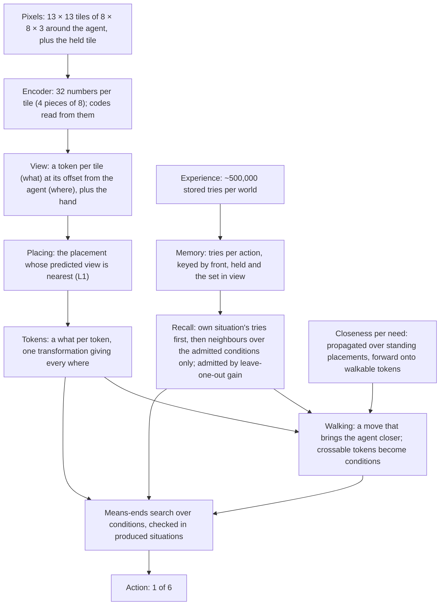

# Architecture

Version 18 is version 17 with orders read from plans and two-part needs
split ([card 074](experiments/074-conflicts-read-from-plans/card.md),
[074.1](experiments/074.1-orders-with-ties-and-split-needs/card.md),
[074.2](experiments/074.2-orders-within-time/card.md), kept 2026-10-06):
- **Orders by planning** (Koehler and Hoffmann's Definition 8, answered
  by the agent's own planner): need B comes before need A when, in the
  situation A's chain produces, the planner finds no plan for B that
  keeps A but finds one that undoes it. No list of parts is used. What a
  pending need relies on is protected the same way: an act is refused
  when, in the situation it produces, a later sibling could then be
  planned only by undoing the need just pursued.
- **Found orders are always followed.** Ties (no order found) go to the
  last step's choice, which is the need it pursued (even alone), while
  that need is unmet and still gives a plan; else to the need whose plan
  has fewer pick ups, toggles and drops, then fewer steps.
- **Two-part needs split.** A stored success that needs both the hand
  and the view changed gives two conditions: "the hand holds h" (card
  056's `has`; h the stored try's held tile) and card 043's one-part view
  need, checked with the situation's own hand and view. Card 043's
  splice is gone.
- **Caches** of recall's pair distance and of part conditions, dropped
  when what they read changes (the same actions at every step).

Decoy world with the key known 100% in every fold (version 17: 99%);
tier 1 100% in 24.4 steps (version 17: 20.8); tier 2 59% (version 17:
25%, better), 4 episodes out of time (6), 0.124 s per step.

Version 17 is version 16 with needs ordered by the states they conflict
over ([card 073](experiments/073-order-needs-by-conflicting-states/card.md),
kept 2026-10-06), Koehler and Hoffmann's reasonable goal orderings tested
on recall's conditions: a condition B comes before a state A when, where
A holds, B does not and every way to B needs a part A fixes (the held
tile, the view or a tile on the map). B is looked for anywhere in a
sibling need's chain, so a blocker inside "face the door" is cleared
before the key is fetched. The states an achiever relies on that hold
now, including "this works with the hand as it is", are protected unless
so ordered. Decoy world with the key known 99% (version 16: 94%); tier 1
100% in 20.8 steps; tier 2 25% (version 16: 2%, better), 0.12 s per step.

Version 16 is version 15 with three parts of one change
([card 072](experiments/072-try-the-likeliest-way/card.md), kept by the
user 2026-10-05):
- **Card 070's encoder**: card 054's recipe plus a term in which a
  key and door are judged "fits" through their relation only, on tiles
  of fresh hues ([card 070](experiments/070-relation-only-fresh-hues/card.md)).
  It separates every matching pair from every other (66 of 66; 9 of 9
  for hues it never saw).
- **The relation `rel:P`**, ‖P(z_front − z_held)‖₁ with P (8 × 32) from that
  training, frozen, in place of recall's per-part relations.
- **Trying the likeliest untried way.** When no plan is found and
  exploration finds nothing, the ways recall does not predict to work
  are ranked by its probability that the action changes the tile, and
  the planner plans under the likeliest untried one as a hypothesis (its
  effect assumed until the try is made). Memory stores the outcome, so a
  failed pair predicts failure from then on.

In card 070's decoy world (a second key of another colour; the right
pair's openings removed from memory) it succeeds in 95–98% of episodes
in all six colour folds (version 15's configuration: 7%), with 0.06–0.09
wrong-key tries per episode; a version that knows the key reaches 94%
there, failing on the same layouts (the hand's conditions, below). Tier 1
100% in 20.8 steps; tier 2 2 of 100 (no different from 0%; both successes
after 16 failed tries and about 90 random steps). Memory still starts
from setup in every episode (the user, 2026-10-05: keeping it across
episodes is not worth its costs for now).

Version 15 is version 14 with walking that keeps nothing per pair of
placements ([card 067](experiments/067-closeness-by-propagation/card.md),
kept 2026-10-05). For one situation and one need, every placement the
agent could stand at takes its closeness to the need from its
neighbours only (the need's placements are 0; any other is one more than
the least of the placements its three moves lead to, forward only onto a
walkable token), iterated to a fixed point; the agent takes a move that
brings it closer. When no placement of the need can be reached, tokens
memory has seen made walkable can be crossed at one step more, and the
first a least route crosses becomes the condition ("walk", j). Version
14's how-soon network and its tables over every pair of the 676
placements are gone, so the token lattice is sized to the map. On
CHARTER's MiniGrid tiers ([card 066](experiments/066-minigrid-tiers/card.md)):
DoorKey-8x8 100% (200 episodes, the same steps as version 14 in 199,
2.1 ms per step against 2.9), BlockedUnlockPickup 0% as version 14 (memory
and recall stop it, not walking), ObstructedMaze-Full: memory cannot yet
be built.

Version 14 is version 13 with each stored pick up, toggle and drop
recording what the agent believed was around it (its tiles seen so far
through the 7 × 7 occluded view, placed by its own motion) instead of
the full window
([card 062](experiments/062-tries-stored-as-believed/card.md); versions
11–14 kept overnight on 2026-10-05 and confirmed by the user the same day,
with card 054's encoder). With it the planner's
whole starting memory is learned from the view the agent has. The same
conditions are discovered (the switch now as "a yellow, on, switch in
view"), and acting is unchanged. Card 064: chained rooms with two doors
30/30 at 1.37 times the shortest route, the cluttered key world 100/100
at 1.27 times (full view: 1.00 and 1.06).

Version 13 is version 12 with the move model and undraw learned from the
7 × 7 occluded view instead of the whole map
([card 061](experiments/061-moves-learned-from-the-small-view/card.md),
kept overnight on 2026-10-05, confirmed by the user): correspondences
are counted only where both places were observed, and one rigid
transformation per move is fitted to them by trimmed least squares;
undraw reads the tile ahead before a forward step. The same
transformations on four encoders, the same steps in every test. Pick up,
toggle and drop still store what was in the full window.

Version 12 is version 11 with MiniGrid's occlusion: walls and closed
doors hide what lies behind them
([card 060](experiments/060-walls-hide-what-is-behind/card.md), kept
overnight on 2026-10-05, confirmed by the user). With no chain of
conditions it looks only at never-seen places next to places it knows
it can walk on; when there are none, it opens a door next to never-seen
places, as a condition ("walk", j) planned like any other, and keeps
that choice between steps. Familiar worlds 100% at 1.12–1.19 times the
full view's steps (version 11 with occlusion: 0–3%), chained rooms with
one door 100% at 1.61 times the shortest route.

Version 11 is version 10 seeing only MiniGrid's 7 × 7 view (six rows
ahead, three columns to each side, nothing behind) instead of a window
that always holds the map
([card 057](experiments/057-view-smaller-than-the-map/card.md), kept
overnight on 2026-10-05 under the user's overnight rules; for the user
to confirm). It places each view among the placements its own action
could lead to, keeps what it has seen as tokens, stores its tries with
the believed view, and, when it has no chain of conditions, walks to the
nearest placement from which never-seen places come into view. Familiar
worlds 100% at 1.10–1.17 times the full view's steps, chained rooms with
one door 100%, no wrong remembered tile in any episode (four encoders of
card 054). Its starting memory is still learned from full views.

Version 10 is version 9 with memory indexed by situation, so the cost
per step no longer grows with memory, and a planner that keeps its
chain between steps: threats between the needs of one achiever, the
choices of the last step tried first, routes through two blocked tokens,
and the hand kept when only the view is asked for
([card 051](experiments/051-planner-chains-and-rules/card.md), kept on
2026-10-04). Version 9 is version 8 with a new recall: an action's outcome is
predicted only from the conditions that changed outcomes in memory, and
a situation's own tries come before its neighbours
([card 049](experiments/049-recall-through-conditions/card.md) and
[card 050](experiments/050-own-tries-first/card.md), kept on
2026-10-04). Version 8 plans on the encoder's vectors, with the state
held as tokens and walking as a learned approach plus its conditions. It
was built up in cards 038–047:
- version 6 was kept with
  [card 043](experiments/043-consistent-hypotheticals/card.md);
- [card 044](experiments/044-state-as-tokens/card.md) made the state a
  set of tokens, each a what and a where;
- [card 045](experiments/045-movement-through-conditions/card.md) made
  walking a learned approach plus its conditions;
- [card 047](experiments/047-situations-from-both-levels/card.md) takes
  the situations for an action on a thing from both of recall's levels.

It follows
the direction signed off in
[card 022](experiments/022-effects-post-mortem/card.md): the primitive is
the effect of an action, learned from the agent's own outcomes, and moves
are actions like any other. It also follows CHARTER.md's "Current
direction": one latent space, codes as names, recall instead of counting.

Given only "reach the goal square", it works backward through what recall
predicts at every step. In four logic-door worlds (the door opens with
the key, the switch, either, or both) it reaches the goal in 100% of 500
new layouts in 5 of 5 encoder seeds. It takes the same steps as version 5
(card 029) to within 0.8%. In unseen rooms (6 × 6, 7 × 7 and mirrored
8 × 8) it reaches the goal in 100%, at 1.01–1.11 times the shortest
route. Version 9 keeps these results (card 050: familiar worlds 100%,
steps 0.93–0.97 times card 029's) and adds robustness to tokens that do
not matter: card 048's chained rooms with one door 98% in every seed
(version 8: 46% in seed 401), and a key world cluttered with extra keys,
switches and vases 98–100% (version 8: 92–100%). Version 10 keeps the
familiar worlds at 100% with card 029's steps and reaches card 048's two
doors in 30 of 30 layouts in every seed (version 9: 0 of 30), one door
100%, the cluttered key world 99–100%; one failure is left in 1,950 test
episodes. Its time per step is 5.7–9.9 ms from base memory to +20,000
stored keys (version 9: 43–4,640 ms). It is not a passed
rung: the world is fully visible, repeats pixels exactly, and every
familiar appearance has been seen.

Version 18 runs as `WM_TRYING=1 WM_CONFLICTS=1 WM_TIES=1 WM_SPLIT=1
WM_CACHE=1 WM_REL_ENCODER=runs/070/encoder.pt bin/prun python
tools/card069/run.py tiers --tier N --online 0 --memory 066`:
`tools/card074.2/cache.py` and `tools/card074.1/ties.py` on
`tools/card074/conflicts.py`, on version 16's code below. Version 16 ran
without the four card 074 flags:
`tools/card072/trying.py` and `tools/card069/relation.py` on card 067's
`propagate.py` and card 066's `tiers.py`. The code is `tools/card062/believed.py` (version 14: card 061's memory with the
believed views, `runs/062/believed_*.npz`) running
`tools/card057/partial.py` (version 11's partial view; version 12 with
`--occlude --frontier --keep-look`), on
`tools/card051/walk2.py` (routes through two tokens), on
`commit.py` (the chain's choices kept between steps), `threats.py`
(threats between needs; the hand kept) and `index.py` (memory indexed by
situation) in the same folder, on `tools/card050/own.py` (own tries first), on
`tools/card049/conditions.py` (recall through admitted conditions;
`worlds.py` holds card 048's chained rooms and the cluttered key world),
on `tools/card047/situations.py`, which builds on:
- `tools/card045/movement.py`: walking through conditions;
- `tools/card044/tokens.py`: the state as tokens;
- `tools/card043/consistent.py`: conditions checked in produced situations;
- `tools/card042/code_recall.py`: recall in two levels;
- `tools/card039/slot_planner.py`: the view as a set;
- `tools/card038/vector_planner.py`: the planner on vectors;
- `tools/card028/effects.py`: the counted move correspondences the
  transformations are fitted to, through card 037's chain.

Version 5, the counted model over exact tile IDs, is in git (commit
`33f9949`).

## In brief

- **Encoder** (card 054, adopted by the user 2026-10-05; version 16 uses
  card 070's, the same recipe plus the relation-only term). A small
  convolutional network maps each 8 × 8 × 3 tile to 32 numbers, in 4
  pieces of 8, trained without a learned codebook: a transition model of
  pick up, toggle and drop on its vectors (against an EMA target), a
  margin between what an action visibly changed, and a margin of 0.5
  between tiles whose pixels differ beyond noise. Identity is "the same up
  to noise": tiles whose pieces lie within 1.25 × the largest distance
  between two noisy renders of one cell share an identity code per piece,
  so codes and vectors are one latent space read at two resolutions. It
  is trained once, offline, and fixed while acting.
- **Memory** keeps every stored try per action, keyed by the vectors of
  the thing in front, the held thing and the set of things in view, with
  its outcomes.
- **Recall** (version 9) predicts a pick up, toggle or drop from the
  **conditions admitted** for that action, and nothing else in view:
  - candidates are the front and held tiles' four parts, the front–held
    relation `rel:P` (version 16; before, a distance per part), and "a
    token with this code tuple is in view";
  - a candidate is admitted while it raises the leave-one-out likelihood
    of the stored outcomes by more than log(number of candidates), so a
    token present in every try (a key always on the floor) never enters;
  - **own tries first:** the tries in the query's own situation (the
    same front and held code tuples, the same admitted view values) are
    the evidence, and the condition-weighted neighbours only their prior
    (α fitted, 0.00012): one failed try overrules the neighbours there.
  - **indexed by situation** (version 10): a query is compared with
    groups of stored keys equal on what the admitted conditions read
    (front tile, held tile, admitted view values), with summed counts,
    not with every key; its own situation is a hash lookup. The same
    predictions as comparing every key.
  Moves, draw and undraw keep version 8's recall.
- **Acting** is card 029's means-ends search, recomputed at every step,
  with the chain kept between steps (version 10): the achiever chosen
  last step for a condition is tried first; when an achiever has two
  unmet needs, one whose plan would break what the other relies on is
  not pursued first (threats); and when only the view is asked for, the
  present hand is protected (version 18: not when the hand is itself a
  need). Since version 18 the order between needs is card 074's (orders
  by planning, found orders followed, ties kept; above); version 17's was
  card 073's reasonable order (above), in place of card 051's threats. A
  condition is checked only in situations that recall's predicted effects
  produce from the present. The situations in which an action could work
  on a thing come from tries on the same thing and on similar things, and
  recall judges each (card 047): a failed try rules out its own
  situation, not the thing. When no plan and no exploration is found, the
  likeliest untried way is tried (card 072, version 16).
- **Walking** (card 067, version 15): per situation and need, a closeness
  propagated over the placements the agent could stand at, each from its
  neighbours (value iteration on the believed map); a move that brings
  the agent closer is taken. A blocked way: tokens memory has seen made
  walkable are crossable at one step more, and the first one a least
  route crosses becomes a condition. Nothing is kept per pair of
  placements; each move is relaxed about once per field. No recall is
  called on an imagined step while walking.
- Time per step 5.7–9.9 ms from base memory to +20,000 stored keys
  (version 9: 43–4,640 ms); 0.24 s per layout in the key world (version
  9: 2.7 s), 0.20–0.64 s in the familiar worlds with five runs sharing
  the machine (version 8: 0.42–0.72 s; version 5: 0.015–0.024 s).

## How the state is represented

Since card 044 the state is a set of tokens:
- **A token** is a what (a tile's vector; its codes are read from it) and a
  where: its offset from the agent (x to the right, y ahead; the place
  ahead is (0, 1)), or the hand. Every tile seen is a token, floor and
  walls included, and so is the held thing. A token exists once seen; a
  where no token holds shows the learned appearance of places entering the
  view (wall here).
- **A move** sends every where but the hand's to M_m where + b_m, fitted
  by least squares to the counted move correspondences (exact: quarter
  turns and a one-tile shift). Since a move moves every token alike, a
  situation stores the whats by token id and one transformation; a
  token's where is that transformation applied to its where at first
  sight. There is no pose table.
- **Readers address tokens by where:** ahead is the token at (0, 1), held
  is the hand's, in view are the tokens within 6 tiles.
- **Recall reads three roles** (declared exception, card 044): the
  token ahead, the hand's, and what is in view, positions dropped. Since
  card 049 the view enters only through admitted conditions, each "a
  token with this code tuple is in view", so tokens no condition reads
  cost nothing.
- **Codes** are discrete per tile (4 identity indices, one per piece,
  from identity up to noise). Recall uses them for "the same thing". They
  name appearances, not things.

Card 040's tokens (each thing its vector plus its role, with attention
over pairs) were stopped and are not used.

## Data structures

| Name | Type and size | What it holds | How it is obtained |
|---|---|---|---|
| Tile vector | float[32], 4 pieces of 8 | One tile's appearance; each distinct vector is stored once (a handle) | The encoder (card 054's recipe, margin 0.5) |
| Code tuple | 4 ints | Which identity class each piece falls in | Leader clustering within 1.25 × the per-piece noise scale (card 054) |
| View | 182 handles: 169 wheres within 6 tiles, plus the held row | What the agent sees now | Encoder on the renderer's tiles |
| Key of a try | (front handle, held handle, view set) | Pick up, toggle, drop. Moves, draw and undraw are keyed by one handle | From the stored views |
| Outcome class | (which places changed, the codes they became) | What a try did | From the try's next view |
| Memory | Per action: keys with outcome counts and result vectors | Every stored try, never merged | 5,000 random episodes per world; real tries are added while acting |
| Admitted conditions | Per pick up, toggle and drop: the front tile's 4 parts plus up to about 4 more (held part, front–held relation per part, a code tuple in view), each with a weight λ | What recall reads | Greedy admission by leave-one-key-out likelihood, cost log(candidates) per condition; λ refitted jointly (card 049) |
| Recall groups (version 10) | Per action: group key → summed outcome counts and a representative key | Stored keys equal on the front tile, the held tile and the admitted view values | Built with memory; per candidate condition while admission weighs it |
| Own situations (version 10) | Hash → outcome counts | A query's own situation | Built with memory |
| Situation classes (version 10) | Front tile → (held tile, admitted view values) → one stored situation | The planner's situations (card 047), one per class | Built with memory |
| Kept choices (version 10) | Condition → achiever, per episode | The chain's choices from the last step | Recorded at each step |
| Own-situation prior | α per action | How much the neighbours count against a situation's own tries | Leave-one-try-out likelihood (card 050) |
| Version 8's recall weights | λ1, λ2, β | Still fitted: the planner's situations (card 047) read them | As version 8 (card 042) |
| Move transformation | Per move: M (2 × 2), b (2) | How a move changes every where | Least squares on the counted correspondences of places before and after moves (cards 028, 044) |
| Placement | One transformation, of those reachable by composing the moves' with the agent within the lattice (676 at 12 tiles; 3,364 at 20) | Where every token is relative to the agent | Composed from the move transformations |
| Tokens, situation | A handle per token id (the first view's places, the held row, the rest within the lattice: 638 ids at 12 tiles, set per map since card 066), "absent" where none seen; (tokens, placement, ended) | Belief, real or imagined | Placed views, written in by where |
| Condition | ("end"), ("walk", j), ("face", a, u, j), ("part", hand or view, a, u, j, c, …) | What must hold for an action to have an effect | Worked out from memory (card 038) |
| Closeness field | Per standing placement of one situation: steps to the need's placements | How close each placement is to a need | Propagated from the need's placements over the reverse moves (card 067); memoised for the step |

## Learning

Per world:
1. **Encoder** (once, offline; card 054, on card 052's generator of
   MiniGrid's objects in six colours plus three more, about 200,000 steps
   of play). The objective has:
   - a transition model predicting the vectors of the tile in front and
     the held tile after pick up, toggle and drop, against an EMA target
     encoder;
   - a margin between the vectors before and after an action that
     visibly changed a tile;
   - a margin of 0.5 between tiles whose pixels differ beyond noise;
   - recall's leave-one-out likelihood of stored outcomes.

   Nothing names what a code means; identity codes are read afterwards,
   up to noise.
2. **Move transformations**: card 028's counted correspondences, then a
   least-squares fit per move (card 044).
3. **Memory**: the stored tries, grouped by key, with outcome counts.
4. **Recall weights**, fitted by leave-one-key-out likelihood of the
   outcome classes, about 25 seconds per world:
   - pick up, toggle and drop: card 042's two levels (kept for the
     planner's situations), then card 049's admission of conditions
     (1–5 s per action) and card 050's α;
   - moves: card 038's single level on the thing in front;
   - card 038's ways (keep, copy, shift, set) are fitted once on stored
     memory (at most 1,000 keys per class) and refitted with admission,
     not after every try (version 10).
5. **How-soon network** (card 045): Q(g, m) = 1 + min Q(T_m g, ·), and 0
   at the target, where T_m is move m's transformation; hindsight, so every
   place and heading is a target. It is exact in open space.

## Acting

At every step:
1. **Place the view.** Take the placement whose predicted view is nearest
   the real one (L1 over vectors, the centre aside). The tokens in view
   take the view's whats. (Version 11) The view is MiniGrid's 7 × 7; only
   observed places count, a never-seen token is no evidence, and the
   candidates are the placements the action could lead to (the same one,
   or the move's). Online tries are stored with the believed view.
2. **Predict effects by recall.**
   - Where the query's own situation has tries, the category and the
     result are what it did then.
   - Otherwise the neighbours over the admitted conditions predict, and
     the result is imagined by carrying the change over from them (card
     038's ways: keep, copy, shift, set).
3. **Work backward** from "episode ended", as in version 5:
   - the achievers of a condition are the actions whose predicted effect
     makes it true;
   - an achiever's needs are its conditions, then facing its thing;
   - a condition on a pick up, toggle or drop comes from memory: which
     part (the hand, or what is in view) must change. Its candidates are
     the situations of the tries on the same thing and on similar things,
     each judged by recall's prediction (card 047);
   - such a need is met in a situation where the action works with that
     situation's own hand and view. That situation comes from imagining
     an achiever's effect on the present (card 043);
   - (version 10) the achiever chosen for a condition at the last step is
     tried first, and the search runs only when it no longer gives a
     plan; of an achiever's unmet needs, each is planned from the
     present, and one whose act breaks what another's plan relies on is
     not pursued first; when card 043 asks only for the view, the
     present hand is a protected link.
4. **Walk** through conditions (card 067):
   - the closeness field of the need's placements (those facing the
     target, standing on a walkable token): forward counts only onto a
     token recall's forward kind says moves the agent; the agent takes a
     move that brings it closer (forward, left, right among equals);
   - when no placement of the need can be reached, tokens recall predicts
     a pick up or toggle can make walkable (card 047) are crossable at one
     step more; the first one a least route crosses becomes the condition
     ("walk", j), pursued like any other; if it cannot be met it is left
     out and the next least route is taken;
   - alternatives (the key or the switch) are chosen by their predicted
     steps;
   - (version 11) when there is no chain at all, walk to the nearest
     placement standing on a known walkable token from which a
     never-seen place would be in view (frontier exploration);
   - (version 12) only never-seen places next to a known walkable token
     count; when there are none, a known token next to never-seen places
     that recall says can be made walkable (a door) becomes the condition
     ("walk", j), kept between steps while it still gives a plan.
5. **Revise** as in version 5.

## Present but not used by the agent

- Card 040's relations by attention over things as tokens
  (`tools/card040/`, stopped).
- Version 5's counted tables and rule lists (`tools/card028`, `card029`),
  used for comparison only.

## Components

| Component | What it does | Input → output | Source (see LITERATURE.md) | Borrowed vs changed |
|---|---|---|---|---|
| Encoder and codes | Tiles to vectors and their identity codes | Pixels → 32 numbers, 4 identity codes | `1711_00937`, `1803_03382`, C-SWM (Kipf et al. 2020), cards 031–036, 052–054 | No codebook: transition model, EMA target, visibility margin and a margin between visibly different tiles; identity up to noise |
| Recall | An action's outcome from stored tries | Key → outcome class and result | MacKay and Peto 1995; Nosofsky's GCM; `1604_02354`; Cheng 1997; Griffiths and Tenenbaum 2005; `1110_2211`; cards 042, 049, 050 | Only admitted conditions read (contrast with a cost per condition); own situation first, neighbours as prior |
| Tokens and placements | What the agent has seen and where it is now | View → (tokens, placement) | Card 016; `1905_12006`; transformer patch tokens (Dosovitskiy et al. 2020); `1812_02230`; card 044; least trimmed squares (Rousseeuw 1984, not in papi); cards 057, 061 | Moves as fitted transformations of where, learned from the 7 × 7 view by a trimmed fit; matching by L1 over observed places, among the placements the action could lead to |
| Looking | Where to go when no chain of conditions exists | Tokens → move or ("walk", j) | Frontier exploration (Yamauchi 1997, not in papi); card 060 | Frontier = never-seen places next to known walkable tokens; a door next to never-seen places becomes a condition, kept between steps |
| Subgoals | Which condition to pursue next, down to an action | Facts, recall → action | `strips`, `cs_9401101`; cards 029, 038, 043 | Conditions from memory, checked in produced situations |
| Walking | Reach a placement facing a target | Tokens, placements, recall → move | Value iteration (Bellman 1957); `1602_02867` (VIN); cards 045, 067 | Propagated on the agent's own believed map, not learned end to end; walkability from recall, neighbours from the learned moves; crossable tokens become conditions; nothing per pair of placements |

## Built-in priors and supplied information

- **The observation** is card 016's egocentric view: the whole room
  (radius 6, 8 × 8 rooms), 8-pixel tiles on a grid, the agent at the
  centre facing up, and the held tile in a fixed place. The agent receives
  pixels only. Since version 12 only MiniGrid's 7 × 7 window ahead of the
  agent is observed, with MiniGrid's occlusion (walls and closed doors
  hide what lies behind them); the rest of the window is unobserved.
- **Declared forms:**
  - "in front", "held" and "in view" are where-values recall's key reads
    (the token at (0, 1), the hand's, the tokens within 6 tiles);
  - wheres lie on the view's grid; tokens are kept within 12 tiles of the
    first view's centre;
  - a tile is 4 pieces of 8 numbers; identity is within 1.25 × the noise
    scale per piece;
  - "new" is 6 × a code's radius;
  - recall's candidate conditions: per part of the front and held tiles,
    a front–held distance per part, a code tuple present in view; a
    condition costs log(number of candidates) to admit;
  - an outcome is predicted when its probability is at least one half;
  - a vector-level neighbour counts at k ≥ 0.01;
  - (versions 11–14) a view is placed only among the placements its
    action could lead to; a never-seen place shows the unseen appearance;
    exploration targets never-seen places next to known walkable tokens,
    then a door next to never-seen places, nearest first, the choice
    kept between steps; a move correspondence counts where both places
    were observed in at least 50 rows and vary, and the fit is trimmed
    until every correspondence lies within half a place.
- **The procedures are designed, not learned:** the order of needs, the
  search depth (6), walking's propagation (card 067's declared
  exception: computed, not a trained System 1),
  and the order of moves among equals (forward, left, right).
- **Goal and experience.** The episode's end is observed, and reaching the
  goal square is the only goal. Experience is 5,000 random episodes per
  world, stored as in version 5. On the MiniGrid tiers (card 066): random
  play of about 3.2 million steps per tier; tiers 2 and 3's goal (holding
  the mission's object) is written in as its tile; the token lattice
  covers the map from any start (12, 14 and 20 tiles).
- **The evaluator** reads the simulator for checks only.

## Known limits

- **Parts mix kind and colour.** Each action now reads only the parts
  admitted for it, but which parts differs by seed (part 0, 2 or 3, held
  or relation), because the encoder spreads colour and kind over all four.
  In seed 403 this let a never-seen purple key read as fitting the red
  door until one try said otherwise. Card 052 (the staged encoder) is
  meant to give colour a part of its own.
- **New colours.**
  - First-sight effects were right in 2 of 5 seeds.
  - The switch world with a new-colour door: mean 76% with card 049's
    recall (above 90% in 7 of 10 runs; seed 401 14%, mostly random
    steps), against 40% in version 8 (card 047). Not rerun with own
    tries first beyond a 6-layout trial.
  - Low support reads as "fails", not "unknown", so a new door may never
    be tried (card 051, change 7).
  - There are no relations ("this key fits this door"), and colour
    transfer is paused by the user.
- **Chance.** An outcome is acted on only when its probability is at least
  one half, so an action that works some of the time in the same
  situation reads as not working (the user, 2026-10-01: later).
- **Conjunctions** (version 18). A success needing both the hand and the
  view changed is two conditions, the view's checked where the hand's
  achiever leaves it (card 074.1); in tier 2 the view need already held
  there in about half the cases.
- **Ties ranked by acts before steps** (version 18). A far need with no
  pick up, toggle or drop beats a near one with one: tier 1 routes 17%
  longer (24.4 steps against 20.8; seed 1001004 walks to the door before
  picking up the key in front of it).
- **Orders are not remembered.** Recall over stored weighings, keyed by
  the two needs' tiles only, did worse than answering "no order" (card
  074); card 076 (draft) tries a learned router over the situation's
  tokens.
- **An achiever whose needs change form.** One failure is left in
  card 051's 1,950 test episodes: cluttered seed 403 layout 93, where
  the chosen achiever's needs alternate in form from step to step, so
  commitment does not hold it.
- **Partial views.** Since version 14 it sees MiniGrid's 7 × 7 view with
  occlusion and its starting memory is learned from that view (cards
  061–062). The encoder's training (card 054) was not re-audited for the
  view. Recall's "a key of another colour does not
  fit" is weak on noisy renders (card 054: 62.5–70% on three of four
  seeds; card 063 did not fix it).
- **A lattice sized in advance.** Tokens live on a fixed grid set per
  map (card 066's prior); walking no longer limits it (version 15), but a
  map whose size is not known in advance needs the lattice to grow.
- **The hand's conditions** (versions 17–18; cards 073–074.2). Version
  18 reads orders from plans, so a blocker is no longer put back on a
  route just cleared (decoy seed 1001002) and tier 2's door need is seen
  to conflict with clearing the ball. Left: with a full hand beside the
  key it needs, the agent can turn between facing the key and turning
  away to drop, never dropping (tier 2 seeds 1002033, 1002008).
- **MiniGrid tier 2 (cards 066, 068, 072–074.2):** version 18 59% (version 17 25%). The agent does not learn to
  free its hand before picking up the box (recall even predicts that a
  locked door opens while a ball is held). With play starts in memory,
  5 of 6 locked door colours are openable; blue is not, because the tile
  recall predicts a toggled blue door becomes (card 038's ways) is no
  catalogue tile and is judged not walkable (card 068).
- **"Same colour" across kinds.** Version 15's encoder (card 054's) does
  not let a weighting tell a matching key and door from another for a
  colour left out (47 of 66, card 069). Card 070's encoder, trained with
  the relation as the only path on fresh hues, does (66 of 66; 9 of 9 for
  hues it never saw), but recall's fit weighs the door's identity 40
  times the relation, so a key never seen opening its door is predicted
  not to (card 070). Fitting recall by leaving whole combinations out
  lowers that weight but not enough: each quarter of the vector carries
  the tile's kind and colour alike, and toggling needs the kind (card
  071). Version 16 has card 070's encoder and `rel:P`; recall still
  ranks a never-seen pair only weakly (0.014 for the right key), and
  trying finds it (1.5 tries per episode). Refitting P after each try
  moved it by Adam's fixed step, not by the evidence, and sometimes
  broke the relation (card 072); it is off.
- **MiniGrid tier 3:** memory cannot be built: recall's fit of its view
  weights compares every pair of distinct stored views. Card 068 removed
  the per-number differences (698 GB there), but the token-pair distances
  alone would still need about 22 GB, and the work grows with the square
  of memory. Tier 2's setup with play-start memory already takes 746 s.
- **Slower than version 5:** 0.20–0.64 s per layout in the familiar
  worlds (version 5: 0.015–0.024); the switch world with a new-colour
  door was 4–19 s in version 8 and is not retimed.
- **Cost and memory size** (the user, 2026-10-03: near-linear before
  BabyAI or Crafter). Per-step cost is flat in memory in the tests (5.7–
  9.9 ms to +20,000 stored keys, card 051). Left: re-admission of
  conditions on grown memory is slower (50 s at +20,000 keys), run only
  on surprise; card 038's transport for a new situation reads every key
  of an outcome class; +50,000 keys was not reached (the test harness,
  not the agent, ran out of memory). Not built: rules compiled from
  recall and a backward pass of cost estimates (card 051, changes 2 and
  4).

## Change log

| arch_version | Date | Card | Change |
|---|---|---|---|
| 1 | 2026-09-27 | 017 | User-authorized shared map and nonspatial context; condition/readiness heads and walking forward path implemented; four structural tests pass, component fitting waits for adequate class coverage |
| 2 | 2026-09-27 | 017 | Replace only readiness's radius-one readout with radius six after exact input collisions; retain the shared map, context, conditions and walking recurrence |
| 3 | 2026-09-28 | 019–020 | Share local spatial feature updates across distance; conditions and readiness use the same processor. Controlled test: both 99.61%; full-tree and learned walking gates remain pending |
| 4 | 2026-09-28 | 022–028 | Direction change signed off with card 022; kept with card 028. Replace the neural spatial learner with counted kinds (027) and a counted model of every action's effects (028); conditions, walking, tree growth and targets computed on it, nothing read from the simulator. 100% in both worlds, the simulator's moves exactly |
| 5 | 2026-09-28 | 029 | Subgoals worked backward through the learned rules (means-ends analysis, recomputed every step) replace the evidence-grown tree and the target rule for acting. 100% in four worlds (key, switch, either, both), 1.03–1.11 times the shortest route, 6–9 conditions per move |
| 6 | 2026-10-01 | 038–043 | Plan on encoder vectors: recall over stored tries replaces the counted tables; the view as a set (039); recall in two levels, equal codes for the same thing and vectors for similar things (042); conditions checked only in situations the learned effects produce (043). Kept by the user with card 043: 100% in all four worlds in 5 of 5 seeds, effects exact, card 029's steps |
| 7 | 2026-10-01 | 044 | The state as tokens: every tile and the held thing a what and a where (offset from the agent, or the hand); moves as least-squares transformations of where, fitted to the counted correspondences (exact); no pose table. Kept by the user with card 044: the same decisions as version 6 in every familiar world, 5 of 5 seeds; 12% slower per layout |
| 8 | 2026-10-01 | 045–047 | Walking through conditions (045): a how-soon network fitted on the move transformations (System 1), the route's tokens walkable as its conditions, waypoint chains and doors as conditions (System 2), no imagined step. Situations for an action on a thing from both of recall's levels, each judged by recall (047, after 046 used the levels as a switch). Kept by the user with card 047: the same results in the familiar worlds, 100% in unseen rooms at 1.01–1.11 times the shortest route; new-colour switch tests 40% (version 7: 31%); 31–77% slower than card 046 |
| 9 | 2026-10-04 | 049–050 | Recall through the conditions that matter: for pick up, toggle and drop, only conditions admitted by their leave-one-out gain (front and held parts, front–held relations, code tuples in view) are compared, so tokens that never changed an outcome cannot veto a memory (049); a query's own situation first, neighbours as its prior, so one failed try corrects recall (050). Kept by the user with card 050: familiar worlds 100% in 5 of 5 seeds, chained rooms with one door 98% (version 8: 46% in seed 401), cluttered key world 98–100%; new-colour switch door 76% with card 049 (version 8: 40%) |
| 10 | 2026-10-04 | 051 | Memory indexed by situation (exact: the same decisions as version 9, per-step time flat from base memory to +20,000 stored keys, 5.7–9.9 ms against version 9's 43–4,640 ms); threats between the needs of one achiever; the chain's choices kept between steps; routes through two tokens made walkable; the hand kept when only the view is asked for. Two doors 30/30 in 5 of 5 seeds (version 9: 0/30), one door 100% (98%), cluttered 99–100%, familiar worlds 100% with card 029's steps. Kept by the user on Claude's overnight runs |
| 11 | 2026-10-05 | 057 | A view smaller than the map: MiniGrid's 7 × 7 view; views placed among the placements the action could lead to (only observed places count); online tries stored with the believed view; frontier exploration when there is no chain. Familiar worlds 100% at 1.10–1.17 times the full view's steps (random when stuck: about 1.7 times), chained rooms with one door 100% at 1.16 times the shortest route, no wrong remembered tile; four encoders of card 054. Kept overnight by Claude under the user's overnight rules; confirmed by the user 2026-10-05 |
| 12 | 2026-10-05 | 060 | Occlusion (MiniGrid's walls and closed doors hide what is behind them): exploration looks only at never-seen places next to known walkable tokens; when there are none, a door next to never-seen places becomes the condition ("walk", j), kept between steps. Familiar worlds 100% at 1.12–1.19 times the full view's steps (version 11 under occlusion: 0–3%), chained rooms with one door 100% at 1.61 times the shortest route (after the declared revision; 71% without keeping the door), no wrong remembered tile; seed 399. Kept overnight by Claude under the user's overnight rules; confirmed by the user 2026-10-05 |
| 13 | 2026-10-05 | 061 | The move model and undraw learned from play seen through the 7 × 7 occluded view: card 028's correspondences counted only where both places were observed and the place varies there, card 044's transformation fitted by least squares trimmed to the correspondences that agree (16 for turns, 35 for forward; residual 0); undraw from the agent on X after a forward step and X ahead before. The same transformations as the full window on four encoders; undraw the same on every tile stepped off, and exact on the goal where the full window had imagined it; acting unchanged (familiar worlds 100%, card 060's steps; chained rooms 100%). Kept overnight by Claude under the user's overnight rules; confirmed by the user 2026-10-05 |
| 14 | 2026-10-05 | 062 | Stored tries of pick up, toggle and drop record what was in view in the agent's belief at that step (tiles seen so far in the episode through the 7 × 7 occluded view, placed by its own motion, never-seen places as the unseen appearance), from a replay of the stored play checked row by row against it. 92–96% of stored tries changed their in-view set; conditions discovered on four encoders (key world: relation or hand; switch world: a yellow switch in view, formerly a grey one); familiar worlds 100% at card 061's steps, chained rooms 100%. Kept overnight by Claude under the user's overnight rules; confirmed by the user 2026-10-05 |
| 14 | 2026-10-05 | 054 | The user adopts card 054's encoder (no learned codebook; identity up to noise; margin 0.5), on which versions 11–14 ran; behaviour unchanged |
| 15 | 2026-10-05 | 067 | Walking by a closeness propagated over the believed map per situation and need, in place of the how-soon network and the tables over every pair of placements; crossable tokens become conditions in one field, in place of single and paired token searches. MiniGrid tier 1 200/200 (as version 14), tier 2 0/100 (as version 14); setup 21 s against 47 |
| 16 | 2026-10-05 | 072 | Card 070's encoder, the relation `rel:P` (P frozen) and trying the likeliest untried way when no plan is found. Decoy folds 95–98% (version 15's configuration 7%; a known key 94%); tier 1 200/200, 20.8 steps; tier 2 2/100 (no different from 0/100) |
| 18 | 2026-10-06 | 074–074.2 | Orders read from plans (Definition 8 answered by the planner; no list of parts), found orders always followed and ties kept as the last step's pursued need, else fewer acts then steps; two-part needs split into "hold h" and the view need, card 043's splice removed; recall's pair distance and part conditions cached (the same actions). Decoy world with the key known 100/100 per fold; tier 1 200/200, 24.4 steps (17: 20.8); tier 2 59/100 (17: 25/100, better), 4 out of time; decoy folds with trying no different |
| 17 | 2026-10-06 | 073 | Needs ordered by the states they conflict over (reasonable goal orderings on recall's conditions, at any depth of the chain), and the states an achiever relies on protected unless so ordered, in place of card 051's threats. Decoy world with the key known 99/100 per fold (version 16 94); tier 1 200/200, 20.8 steps; tier 2 25/100 (version 16 2/100, better); decoy folds with trying no different |
