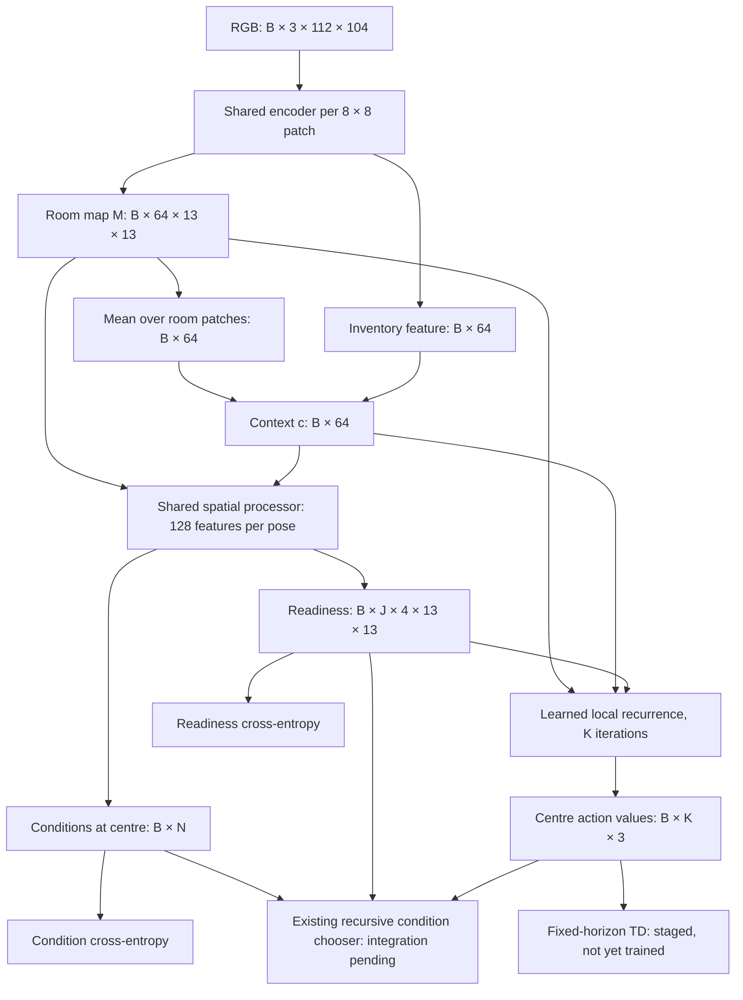

# Architecture

Version 3 is the shared spatial learner introduced in
[card 017](experiments/017-summary-without-position/card.md) and refined by
[cards 018–020](experiments/020-shared-condition-readout/card.md). It passes
one controlled, evaluator-labelled readiness/condition test at 99.61%,
against 50% for a local-only readiness head. It is not a passed rung,
full-tree retention result, or learned walking result. The earlier condition
prototype is `src/worldmodel/discover_logic.py`; its frozen network and
separately trained walker remain historical baselines. The new module is
`src/worldmodel/spatial_state.py`.

[Card 021](experiments/021-full-tree-spatial-gate/card.md), still open for
review, resolves full-tree evaluator coverage but fails the exact-label gate.
At 10,000 updates, training condition recall is at least 99.47%, while
held-out condition false positives reach 38.28% against a 1% limit. Errors
also occur on familiar geometry and collected experience. The controlled
99.61% result therefore does not generalize to the full tree. The model is
unchanged; learned-label training and walking integration remain gated.

## Overview

The state is a spatial feature map plus context without a location axis.
One encoder supplies every head; no teacher features or simulator variables
enter the learner. B is batch size, N the number of condition nodes, J the
number of accepted ways, and K the walking horizon (currently 24).

## Latent state

`SpatialState(M, c)` is the one learned state. M has one 64-dimensional
feature per image patch; these are locations, not supplied object slots.
Three convolutions (4 × 4 kernels, stride 2, padding 1; channels 32, 64, 64)
encode each 8 × 8 RGB patch independently, with shared weights and ReLU
activations. The same weights encode the inventory patch.

Context is `ReLU(Linear(concat(mean(M), inventory)))`, 128 → 64.
Pooling precedes spatial mixing, so rearranging whole room patches preserves
c up to floating-point rounding. It can retain appearance counts and
carried-item evidence; spatial relations remain available in M.

Nothing persists across observations. Memory and partial visibility are
unimplemented; the entire small room is visible in this experiment.

## One update step

1. Render an egocentric RGB observation and encode its patches once.
2. For each queried facing, rotate M to a canonical orientation. A masked
   3 × 3 convolution projects its features to 128 channels, adds a linear
   projection of c, then applies ReLU to form H0. Compute five updates
   `H_next = ReLU(H0 + Conv3x3(H))`, using the same learned convolution each
   time. Together these operations have radius six. Undo the output rotation.
   These are spatial feature updates, not simulated actions or time steps.
3. Read readiness with a 1 × 1 projection of these features at every pose.
   Read conditions with a linear projection of the same features at the
   actual agent's centre, facing up. Both losses train the same patch encoder
   and spatial processor. The old flat condition readout is a control only.
   Local-only and wide-filter readiness remain diagnostic controls: the
   first loses remote goal information; the second gives each offset separate
   parameters and failed at a goal distance absent from training. A door can
   make a goal reachable or the goal may already be reachable on this side;
   the local appearance of the door and inventory alone cannot say which.
4. For a selected way, initialize a four-facing value field from readiness.
   The walking step receives its sigmoid, 32 projected map features and 16
   projected context features. A 3 × 3 convolution to 64 channels, ReLU and
   1 × 1 convolution produce 3 × 4 action/facing logits. Replace each value
   with the maximum of readiness and the three action logits. Repeat K times.
5. Read the centre, facing up. In later acting, sum K action probabilities
   to rank moves; the existing tree chooses a way and its achieving action.
   This integration waits for the component gates.

## Components

| Component | What it does | Input → output (shapes) | Source (see LITERATURE.md) | Borrowed vs changed |
|---|---|---|---|---|
| Shared encoder | Retains spatial and nonspatial evidence | RGB → M, c | Cards 005, 012, 017 | Existing convolution sizes, now independent patches; context split is our design |
| Spatial processor | Shares feature computation across locations and distance | M, c → 128 features per queried pose | Cards 019–020; local weight sharing inspired by VIN | Our feature recurrence; no supplied transitions or Bellman guarantee |
| Conditions | Reads learned condition truth | Shared centre features → B × N | Cards 012, 020 | Existing learned tree; uses the same processor as readiness |
| Readiness | Predicts whether a way's action works at a queried pose | Shared features → B × J × 4 × 13 × 13 | Cards 017–020 | Oriented recurrent readout replaces the information-limited local head and offset-specific wide head |
| Walking | Repeated local computation | M, c, readiness → B × K × 3 | VIN; cards 014, 016 | Nonlinear recurrence differs from VIN's Bellman-like update |
| Recursion | Chooses a condition and achieving action | Head outputs → way/action | Cards 007–008, 010, 012 | Existing tree retained; transfer first, no fresh discovery in this card |

## Built-in priors and supplied information

- A full-room egocentric grid, 13 × 13 tiles, plus an inventory display row;
  8 pixels per tile, fixed centre and facing up, as card 016. This differs
  from the charter's later partial 7 × 7 chained-room task.
- Room and inventory patches are separated by fixed image coordinates.
  The learner receives RGB, not tile codes, inventory labels or agent pose.
  The environment renderer uses pose to produce the egocentric observation.
- Locality, aligned patches, rotation sharing over tile arrangements, and
  the initial masked kernel are explicit priors. The first kernel omits its
  centre, but later recurrent updates can receive that cell indirectly.
  Radius six covers the small room from a valid interior pose; this fixed
  extent is not claimed to scale to larger worlds. No fixed object slots
  are used. Inventory context remains invariant to room-patch permutations.
- The logic world has six actions, including drop. Walking actions (left,
  right, forward) are identified as in card 012. Their effects, object
  meanings, condition truth and readiness are learned in the non-oracle arm.
- The existing learned tree, its node budget, persistence estimates, 0.5
  truth cutoff and 5% random walking are retained. This is representation
  transfer, not fresh discovery or a new-goal result.
- Run 5 supplies cached learned labels during migration, then is discarded.
  All heads train the same new encoder. Oracle labels are confined to the
  upper bound and evaluator; their fit cannot count as learned success.
- The random-play/play-start policy and held-out column follow the card.
  Teacher weights previously saw that column, limiting the transfer claim.
  CNN weights initialize from run 5 and remain trainable.
- No reconstruction, object-classification, memory or imagined-frame loss.
  Context invariance is structural; semantic adequacy must be measured.
- Cards 018–020 deliberately move the goal between rooms in paired scenes
  to test binding while holding geometry and inventory fixed. This is an
  evaluator-labelled upper bound, not a change to agent experience or a
  source of labels for the learned full-tree run. Its two fitted heads concern
  one condition and its readiness; they are not the full discovered tree.

## Training signals

The implemented component stage uses `L = L_condition + L_ready`.
`BCE_balanced` gives equal weight to positive and negative cross-entropies
per output, omitting a class absent from a minibatch. Both losses are logged.

- `L_condition = BCE_balanced(condition_logits(M,c), condition_target)`:
  keep discovered conditions readable from the shared state.
- `L_ready = BCE_balanced(ready_logits(M,c), ready_target)`:
  learn where an achieving action works. Learned labels supervise only
  observed centre poses; the upper bound labels every valid pose.
- Planned joint stage: `L_walk = BCE(Q_k(s,a), stopgrad(V_target,k-1(s')))`
  on observed walking actions, with ready successors set to one and terminal
  non-ready successors to zero. Q and V denote probabilities; the future
  implementation should use logits for cross-entropy. Readiness and condition
  losses remain active. No joint training result exists yet.

The planned delayed target is a copy of the same learner. Sharing weights
across horizons means the fixed-horizon paper's convergence theorem does
not guarantee convergence of this implementation.

## Change log

| arch_version | Date | Card | Change |
|---|---|---|---|
| 1 | 2026-09-27 | 017 | User-authorized shared map and nonspatial context; condition/readiness heads and walking forward path implemented; four structural tests pass, component fitting waits for adequate class coverage |
| 2 | 2026-09-27 | 017 | Replace only readiness's radius-one readout with radius six after exact input collisions; retain the shared map, context, conditions and walking recurrence |
| 3 | 2026-09-28 | 019–020 | Share local spatial feature updates across distance; conditions and readiness use the same processor. Controlled test: both 99.61%; full-tree and learned walking gates remain pending |
