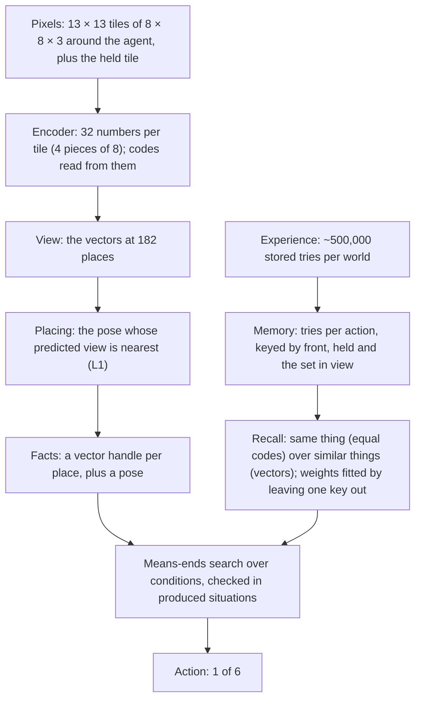

# Architecture

Version 6 plans on the encoder's vectors. It was built up in cards
038–043 and kept with
[card 043](experiments/043-consistent-hypotheticals/card.md). It follows
the direction signed off in
[card 022](experiments/022-effects-post-mortem/card.md): the primitive is
the effect of an action, learned from the agent's own outcomes, and moves
are actions like any other. It also follows CHARTER.md's "Current
direction": one latent space, codes as names, recall instead of counting.

Given only "reach the goal square", it works backward through what recall
predicts at every step. In four logic-door worlds (the door opens with
the key, the switch, either, or both) it reaches the goal in 100% of 500
new layouts in 5 of 5 encoder seeds. It takes the same steps as version 5
(card 029) to within 0.3%. It is not a passed rung: the world is fully
visible, repeats pixels exactly, and every familiar appearance has been
seen.

The code is `tools/card043/consistent.py`, which builds on:
- `tools/card042/code_recall.py`: recall in two levels;
- `tools/card039/slot_planner.py`: the view as a set;
- `tools/card038/vector_planner.py`: the planner on vectors;
- `tools/card028/effects.py`: poses and facts, through card 037's chain.

Version 5, the counted model over exact tile IDs, is in git (commit
`33f9949`).

## In brief

- **Encoder.** A small convolutional network maps each 8 × 8 × 3 tile to
  32 numbers, in 4 pieces of 8. Each piece has a codebook of 8 learned
  codes. A code is a region of its piece's space (the cells around one
  entry), so codes and vectors are one latent space read at two
  resolutions. It is trained once, offline, and fixed while acting.
- **Memory** keeps every stored try per action, keyed by the vectors of
  the thing in front, the held thing and the set of things in view, with
  its outcomes.
- **Recall** predicts an action's outcome in two levels:
  - the same thing: stored tries whose front and held things have equal
    codes, weighted by how alike their views are;
  - similar things: a learned weighting of the vectors, used where the
    same thing has no tries.
- **Acting** is card 029's means-ends search, recomputed at every step. A
  condition is checked only in situations that recall's predicted effects
  produce from the present.
- About 0.26–0.92 seconds per layout (version 5: 0.015–0.024).

## Data structures

| Name | Type and size | What it holds | How it is obtained |
|---|---|---|---|
| Tile vector | float[32], 4 pieces of 8 | One tile's appearance; each distinct vector is stored once (a handle) | The encoder (card 037's recipe) |
| Code tuple | 4 ints, or "new" per piece | Which codebook region each piece falls in | Nearest used code within 6 × its radius, else "new" (card 035), with fresh codes for new pieces (card 036) |
| View | 182 handles | What the agent sees now | Encoder on the renderer's tiles |
| Key of a try | (front handle, held handle, view set) | Pick up, toggle, drop. Moves, draw and undraw are keyed by one handle | From the stored views |
| Outcome class | (which places changed, the codes they became) | What a try did | From the try's next view |
| Memory | Per action: keys with outcome counts and result vectors | Every stored try, never merged | 5,000 random episodes per world; real tries are added while acting |
| Recall weights | Similar level λ2 (front, held, view); same level's view weights λ1v ≥ λ2v; mix β | What recall compares | Fitted jointly by leaving one stored key out (card 042) |
| Move maps, poses | As version 5: 484 poses, each with the first view's place per view place | Where the agent is | Counted co-occurrences of handles before and after moves (card 028) |
| Facts, situation | Handles per place in the first view's frame; (facts, pose, ended) | Belief, real or imagined | Placed views, written in |
| Condition | ("end"), ("walk", j), ("face", a, u, j), ("part", hand or view, a, u, j, c, …) | What must hold for an action to have an effect | Worked out from memory (card 038) |

## Learning

Per world:
1. **Encoder** (once, offline). The objective has:
   - rebuilding the tile's pixels through a decoder;
   - codebook and commitment terms;
   - a pair term, so that an action changing a tile in place changes few
     codebooks;
   - μ = 0.01 times a recall term: the leave-one-out likelihood of stored
     outcomes.

   Nothing names what a code means.
2. **Move maps and poses**, counted as in version 5.
3. **Memory**: the stored tries, grouped by key, with outcome counts.
4. **Recall weights**, fitted by leave-one-key-out likelihood of the
   outcome classes, about 25 seconds per world:
   - pick up, toggle and drop: card 042's two levels;
   - moves: card 038's single level on the thing in front.

## Acting

At every step:
1. **Place the view.** Take the pose whose predicted view is nearest the
   real one (L1 over vectors, the centre aside). Write it into the facts.
2. **Predict effects by recall.**
   - Where the same thing has tries, the category and the result are what
     it did then: the stored result of the best supported outcome class.
   - Otherwise the similar-thing level predicts, and the result is
     imagined by carrying the change over from similar things (card 038's
     ways: keep, copy, shift, set).
3. **Work backward** from "episode ended", as in version 5:
   - the achievers of a condition are the actions whose predicted effect
     makes it true;
   - an achiever's needs are its conditions, then facing its thing;
   - a condition on a pick up, toggle or drop comes from memory: which
     part (the hand, or what is in view) must change, from the stored
     successes on the same thing;
   - such a need is met in a situation where the action works with that
     situation's own hand and view. That situation comes from imagining
     an achiever's effect on the present (card 043).
4. **Walk** and **revise** as in version 5. Walking is the hand-set
   closeness, moving closer in imagination, and move ways.

## Present but not used by the agent

- Card 040's relations by attention over things as tokens
  (`tools/card040/`, stopped).
- Version 5's counted tables and rule lists (`tools/card028`, `card029`),
  used for comparison only.

## Components

| Component | What it does | Input → output | Source (see LITERATURE.md) | Borrowed vs changed |
|---|---|---|---|---|
| Encoder and codes | Tiles to vectors and their codebook regions | Pixels → 32 numbers, 4 codes | `1711_00937`, `1803_03382`, cards 031–036 | Pair and recall terms added; "new" by radius; fresh codes |
| Recall | An action's outcome from stored tries | Key → outcome class and result | MacKay and Peto 1995; Nosofsky's GCM; `1604_02354`; card 042 | Two levels: equal codes, then a learned vector metric; fitted by leave-one-key-out |
| Facts and poses | Where the agent is in what it has seen | View → (facts, pose) | Card 016; `1905_12006` | Matching by L1 over vectors |
| Subgoals | Which condition to pursue next, down to an action | Facts, recall → action | `strips`, `cs_9401101`; cards 029, 038, 043 | Conditions from memory, checked in produced situations |
| Walking | Reach a pose facing a target | Facts, poses, move recall → move | Cards 024, 026 | Unchanged from version 5 |

## Built-in priors and supplied information

- **The observation** is card 016's egocentric view: the whole room
  (radius 6, 8 × 8 rooms), 8-pixel tiles on a grid, the agent at the
  centre facing up, and the held tile in a fixed place. The agent receives
  pixels only.
- **Declared forms:**
  - "in front", "held" and "in view" are fixed slots of recall's key;
  - a tile is 4 pieces of 8 numbers, with codebooks of 8;
  - "new" is 6 × a code's radius;
  - an outcome is predicted when its probability is at least one half;
  - a vector-level neighbour counts at k ≥ 0.01.
- **The procedures are designed, not learned:** the order of needs,
  choosing the nearest target among alternatives, the search depth,
  walking's closeness and move ways.
- **Goal and experience.** The episode's end is observed, and reaching the
  goal square is the only goal. Experience is 5,000 random episodes per
  world, stored as in version 5.
- **The evaluator** reads the simulator for checks only.

## Known limits

- **One identity level.** The same-thing level reads all four codebooks
  for every action, so each thing is its own kind. "Each rule reads only
  the codebooks it needs" is not done, and colour transfer needs it.
- **New colours.**
  - First-sight effects were right in 2 of 5 seeds.
  - The switch world with a new-colour door reached the goal in 8–74%.
  - There are no relations ("this key fits this door"), and colour
    transfer is paused by the user.
- **Conjunctions.** A success that needs both the hand and the view
  changed is still checked in a spliced situation (card 043's declared
  exception).
- **Exact views.** It needs the whole room in view and exact pixel
  repeats. Codes absorb small differences, but this is untested with
  noise, and vectors near a region's edge could flip codes between views.
- **Movement is not yet fully conditional** (noted with the user on
  2026-09-30).
  - Facing a thing is a condition, but reaching it is a fixed rule: moving
    closer by a hand-set distance (grid distance, then turns), checked by
    playing it forward in the head one step at a time, with move ways from
    every standing pose.
  - Only a place that must change, such as a door, becomes a condition;
    an obstacle to go around does not.
  - Card 041 (where-tokens, a learned how-soon) and card 044 (obstacles as
    conditions) are next.
- **The choice between alternatives** (the key or the switch) is a
  declared rule, the nearest target.
- **Slower than version 5:** 0.26–0.92 s per layout, against
  0.015–0.024.

## Change log

| arch_version | Date | Card | Change |
|---|---|---|---|
| 1 | 2026-09-27 | 017 | User-authorized shared map and nonspatial context; condition/readiness heads and walking forward path implemented; four structural tests pass, component fitting waits for adequate class coverage |
| 2 | 2026-09-27 | 017 | Replace only readiness's radius-one readout with radius six after exact input collisions; retain the shared map, context, conditions and walking recurrence |
| 3 | 2026-09-28 | 019–020 | Share local spatial feature updates across distance; conditions and readiness use the same processor. Controlled test: both 99.61%; full-tree and learned walking gates remain pending |
| 4 | 2026-09-28 | 022–028 | Direction change signed off with card 022; kept with card 028. Replace the neural spatial learner with counted kinds (027) and a counted model of every action's effects (028); conditions, walking, tree growth and targets computed on it, nothing read from the simulator. 100% in both worlds, the simulator's moves exactly |
| 5 | 2026-09-28 | 029 | Subgoals worked backward through the learned rules (means-ends analysis, recomputed every step) replace the evidence-grown tree and the target rule for acting. 100% in four worlds (key, switch, either, both), 1.03–1.11 times the shortest route, 6–9 conditions per move |
| 6 | 2026-10-01 | 038–043 | Plan on encoder vectors: recall over stored tries replaces the counted tables; the view as a set (039); recall in two levels, equal codes for the same thing and vectors for similar things (042); conditions checked only in situations the learned effects produce (043). Kept by the user with card 043: 100% in all four worlds in 5 of 5 seeds, effects exact, card 029's steps |
