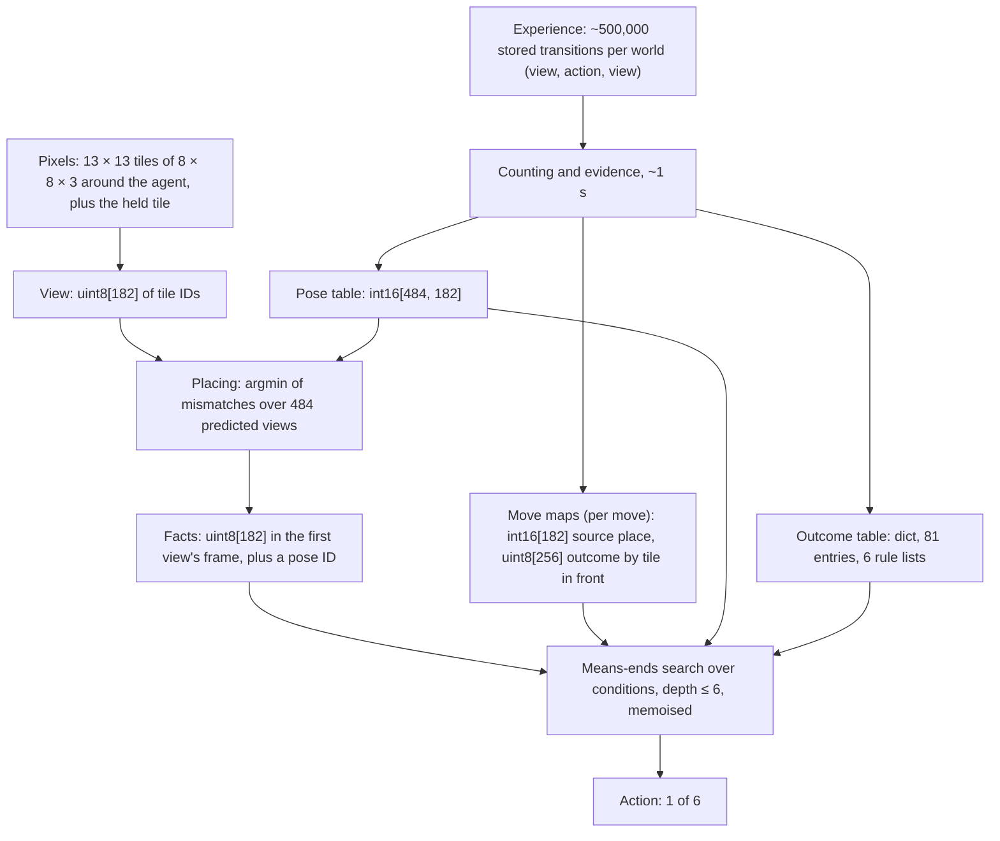

# Architecture

Version 5 is the counted model of
[card 028](experiments/028-learned-effects-model/card.md) with subgoals
worked out from it, kept with
[card 029](experiments/029-subgoals-from-the-model/card.md). It follows
the direction signed off with the user in
[card 022](experiments/022-effects-post-mortem/card.md): the primitive is
the effect of an action, learned from the agent's own outcomes, and moves
are actions like any other. Given only "reach the goal square", it works
backward through its learned rules at every step. In four logic-door
worlds (the door opens with the key, the switch, either, or both) it
reaches the goal in 100% of 500 new layouts, at 1.03–1.11 times the
shortest route's steps. It is not a passed rung: the world is fully
visible, repeats pixels exactly, and every appearance has been seen.

The code is `tools/card029/subgoals.py` (subgoals and acting) on
`tools/card028/effects.py` (the model, facts, poses, walking). Version 3,
the neural spatial learner of cards 017–021
(`src/worldmodel/spatial_state.py`), failed its full-tree gate (card 021)
and is historical; its description is in git (commit `dab1240`).

## In brief

There are no neural networks, embeddings or gradients in the agent.
Version 5 is a symbolic model built by counting, plus a search over it:

- **Symbols.** Each 8 × 8 × 3 pixel tile becomes an integer ID by exact
  identity of its pixels. A view is a vector of 182 such IDs. About 20
  IDs occur in a world.
- **Learning is counting.** About 500,000 stored transitions per world
  are counted into lookup tables. Where one key of a table has several
  outcomes, a Bayesian evidence score (Beta-Bernoulli) chooses a short
  rule list. It takes about a second per world.
- **The model is lookup tables:** numpy arrays indexed by view place and
  tile ID, and a Python dict of 81 outcome entries (key world), six of
  them with a one-condition rule.
- **Acting is search.** A depth-limited, memoised, depth-first
  means-ends search over imagined states, recomputed at every step: 6–9
  conditions evaluated per move, 0.015–0.024 seconds per layout.
- Floating point appears only in evidence scores and rule rates. The GPU
  is used once, to count co-occurrences (one-hot matrix products) when
  fitting the move maps.

## Data structures

| Name | Type and size | What it holds | How it is obtained |
|---|---|---|---|
| Tile ID | uint8 (about 20 values occur, at most 256) | One exact 8 × 8 × 3 pixel tile | Identity of pixels (a lookup built from the renderer's tile images; tiles with equal pixels share an ID) |
| View | uint8[182]: 13 × 13 places centred on the agent, facing up, plus a 13-place held row (only its first place varies) | What the agent sees now | The renderer |
| Experience | About 500,000 (view, action, view) triples per world, with weights | Random play | Every step in which a tile other than the agent changes or the episode ends, and one in eight of the rest (weight 8); plus 300 full episodes |
| Move map, one per move (left, right, forward) | `src` int16[182], `ent` uint8[182], `trans` uint8[182, 256] | For each place after the move, the place before it came from, or −1 with the tile entering at the edge; `trans` draws and undraws the agent at the centre | Argmax over co-occurrence counts of (place, ID) before and after, on up to 40,000 transitions in which the view changed |
| Move outcome, one per move | uint8[256], by the tile in front: view changed, unchanged, or episode ended | Forward onto floor or an open door moves; onto a wall, key or closed door does not; onto the goal ends the episode | Weighted majority |
| Draw, undraw, free | uint8[256], uint8[256], bool[256] | The centre tile with and without the agent; the tiles one can walk onto | Forward's `trans` at the centre; free = forward's outcome "changed" |
| Pose table | `A` int16[484, 182], `Ent` uint8[484, 182], `nxt` int[484, 3] | 484 poses (11 × 11 places × 4 directions): for each, which place of the first view each view place shows, and the pose after each move | Closure of compositions of the move maps, starting from the first view |
| Outcome table | dict, 81 keys in the key world: (action, front ID), or (drop, front ID, held ID) | The change at the two places pick up, drop and toggle ever change (in front, held): a pair of IDs, "same", or nothing | Weighted counts; a key with one outcome stores it directly |
| Rule list | Per key with several outcomes: [(outcome, [(conditions, rate)], default rate)]; a condition is "held = X" or "X in view" | Toggle closed red door → open red door if held = key red (rate 1.0), otherwise never; pick up key red → held if held = floor | Card 010's evidence search, below. Six in the key world |
| Facts | uint8[182] in the frame of the episode's first view, interned as bytes → int | The agent's belief about every tile, its own tile undrawn | Overwritten from each placed view |
| Situation | (facts ID, pose ID, ended flag) | A real or imagined state | Hashable; every derived quantity is memoised on it |
| Condition | Tuple: ("end"), ("held", X), ("view", X), ("tile", j, X), ("face", action, X, j) | A fact about the facts; "facing" is a frozenset of pose IDs | Computed from the facts |
| Operator | (action, front ID, held ID, front after, held after, alternatives of rule conditions) | One learned outcome read as needs → results | One per outcome, and per rule alternative with rate ≥ 0.5 |

## Learning

Per world, from the stored transitions, in about a second:

1. **Move maps.** Count C[(p, u), (q, v)], the number of transitions with
   ID u at place p before and ID v at place q after. The source of place
   q is the p that best predicts it: argmax over p of Σ_u max_v C. A
   place whose ID after never varies is an entering place.
2. **Poses.** Compose the move maps breadth first from the identity
   until no new (centre place, facing) pair appears: 484 poses, with no
   route conflicts.
3. **Outcomes.** Group the pick-up, drop and toggle transitions by key
   and count the change at the front and held places.
4. **Rules** (card 010), for a key with several outcomes. The rows are
   the distinct combinations of atoms ("held = X" for each held ID, "X in
   view" for each ID present), each with weighted tries n and successes
   k. A rule list covers rows in order; its score is Σ log B(k + 1,
   n − k + 1) over each rule's rows and the default rows, minus log 2 per
   rule and log 2 + log(number of atoms) per atom. Every rule must succeed
   more often than the default. The search is greedy, adding or removing
   one atom or rule at a time, and trying pairs when stuck.

## Acting

At every step:

1. **Place the view.** Predict the view from each of the 484 poses (the
   facts gathered through the pose table, `Ent` outside it), count
   mismatches with the real view over 181 places (the centre aside), and
   take the pose with the fewest. Write the view into the facts, with the
   centre undrawn.
2. **Work backward.** Start from the condition "episode ended". Its
   achievers are the operators whose result makes it true. Each
   achiever's needs are checked in order (the held tile, for drop; the
   rule's conditions; facing the tile), and the first unmet need becomes
   the subgoal, recursively, to depth 6. Among achievers: the fewest unmet
   needs, then the nearest target. Imagined steps use the tables: a move
   through its outcome table and `nxt`; pick up, drop and toggle through
   the outcome entry, its rules evaluated on the held ID and the set of
   IDs in view.
3. **Walk.** A facing need is a set of target poses. Closeness is the
   pair (Manhattan distance on the frame's grid, turns), compared in that
   order. Moving closer takes the first of forward, left, right that
   lowers it in imagination. When that fails: move ways (the poses from
   which one or two moves let moving closer succeed); then a tile in the
   way, which an operator can make walkable, becomes a subgoal.
4. **Revise.** Refuse an action that undoes a condition met higher in
   the chain, or makes a facing higher in the chain unreachable. Mark an
   (action, tile, pose) failed when the real outcome differs from the
   predicted one.

## Present but not used by the agent

- **Kinds** (card 027): appearances grouped by what actions do to them
  (bisimulation refinement, agglomerative merging by Dirichlet-multinomial
  evidence). Computed in cards 028–029 only for their comparison arms.
- **Two small MLPs** (card 027), on a tile's 192 flattened pixels: a
  4-bit code (192 → 128 → 128 → 4, with a head predicting effects) and a
  kind recogniser (192 → 128 → 128 → kinds). Kept for recognising new
  appearances; the agent does not use them.

## Components

| Component | What it does | Input → output | Source (see LITERATURE.md) | Borrowed vs changed |
|---|---|---|---|---|
| Effects | What each action does to the facts | Facts, action → next facts | `1110_2211`, `an-object-oriented-representation-for-efficient-reinforcemen` | Rules over appearances counted from pixels, not supplied objects; move maps counted, not declared |
| Rules | When an effect happens | Atoms "held = X", "X in view" → rate | `1511_01644` (card 010) | Reused unchanged, positive atoms, storage weights |
| Facts and poses | Where the agent is in what it has seen | View → (facts, pose) | Card 016; `1905_12006` | Poses from composing learned moves; placing by matching |
| Subgoals | Which condition to pursue next, down to an action | Facts, learned outcomes and rules → action | `strips`, `cs_9401101`; card 029 | Operators counted from pixels, not written by hand; re-evaluated from the top every step; card 027's revision rules generalised |
| Walking | Reach a pose facing a target | Facts, poses, learned moves → move | Cards 024, 026 | Moving closer, then move ways computed in the head; a tile in the way becomes a subgoal |
| Kinds (comparison arms only) | Groups appearances by what actions do to them | Front appearances, outcomes → kind per appearance | `equivalence-notions-and-model-minimization-in-markov-decisio`, `1412_2309` | Bisimulation over appearances in front, scored by evidence |

## Built-in priors and supplied information

- The observation is card 016's egocentric view: the whole room (radius 6,
  8 × 8 rooms), 8-pixel tiles on a grid, the agent at the centre facing
  up, a held tile in a fixed place. The renderer uses the simulator's pose
  to produce it; the agent receives pixels only.
- Appearances are exact pixel tiles: identity by exact repeat, no noise.
  "In front" and "held" are fixed places; a thing looks the same wherever
  it is (card 027).
- Declared forms: a move leaves the view as it was or sends every tile to
  one fixed place; a pose is where the agent stands and which way it
  faces; outcomes are keyed by the tile in front (and held, for drop); an
  outcome is reachable when its rate is at least one half; an unseen
  appearance is blocked and unchanged by every action.
- The procedures are designed, not learned: the evidence tests, the
  kinds of condition, the order of needs, choosing the nearest target
  among alternatives, depth 6, move ways two moves deep, moving closer by
  the step measure.
- The episode's end is observed, and reaching the goal square is the only
  goal. Experience is 5,000 episodes of up to 640 uniformly random
  actions per world. Which steps count as changes, for storage, is read
  from the simulator's tiles (a data policy; the agent never sees it).
- The evaluator reads the simulator for the checks only: facts against the
  simulator's contents, and learned conditions against exact ones.

## Known limits

- Knows nothing about appearances it has not seen: from 500 episodes, an
  unseen "agent on an open green door" made that door a wall, and
  agreement with exact conditions fell to 68% for one node (card 028).
- Rules are per appearance ("held = key red" for the red door), not
  relations ("held key's colour = door's colour"); they will not carry to
  new colours.
- Needs the whole room in view and exact pixel repeats; no memory, no
  partial views, no noise.
- Walking in the head chains steps one by one (card 022's open point for
  P21), and gets stuck on long detours: a tile in the way counts only if
  walking then succeeds, so the door is not found as the obstacle when the
  way to it is a detour (2 layouts of 2,000, card 029).
- The choice between alternatives (the key or the switch) is a declared
  rule, the nearest target, not learned from the agent's own costs.

## Change log

| arch_version | Date | Card | Change |
|---|---|---|---|
| 1 | 2026-09-27 | 017 | User-authorized shared map and nonspatial context; condition/readiness heads and walking forward path implemented; four structural tests pass, component fitting waits for adequate class coverage |
| 2 | 2026-09-27 | 017 | Replace only readiness's radius-one readout with radius six after exact input collisions; retain the shared map, context, conditions and walking recurrence |
| 3 | 2026-09-28 | 019–020 | Share local spatial feature updates across distance; conditions and readiness use the same processor. Controlled test: both 99.61%; full-tree and learned walking gates remain pending |
| 4 | 2026-09-28 | 022–028 | Direction change signed off with card 022; kept with card 028. Replace the neural spatial learner with counted kinds (027) and a counted model of every action's effects (028); conditions, walking, tree growth and targets computed on it, nothing read from the simulator. 100% in both worlds, the simulator's moves exactly |
| 5 | 2026-09-28 | 029 | Subgoals worked backward through the learned rules (means-ends analysis, recomputed every step) replace the evidence-grown tree and the target rule for acting. 100% in four worlds (key, switch, either, both), 1.03–1.11 times the shortest route, 6–9 conditions per move |
